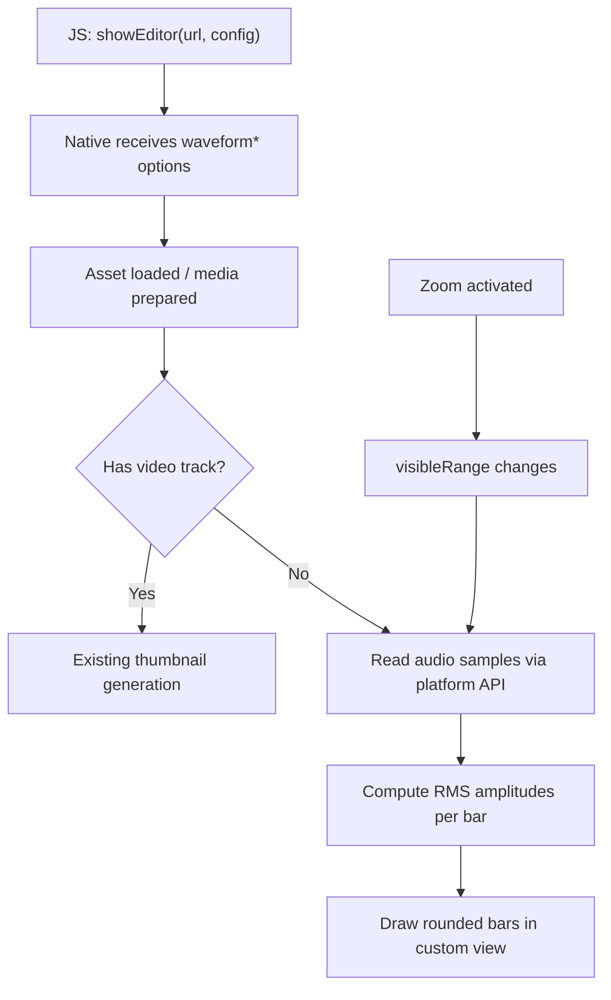

# Audio Waveform for Trimmer Strip

## Architecture

The waveform replaces the thumbnail strip when the file is audio-only. On both platforms, a custom waveform view draws amplitude bars into the same container that holds video thumbnails (`thumbnailTrackView` on iOS, `thumbnailContainer` on Android). The waveform regenerates on zoom using the same invalidation pattern as video thumbnails.




## 1. JS API Changes

In [src/NativeVideoTrim.ts](src/NativeVideoTrim.ts), add to `EditorConfig`:

```typescript
waveformColor?: number;
waveformBackgroundColor?: number;
waveformBarWidth?: number;
waveformBarGap?: number;
waveformBarCornerRadius?: number;
```

In [src/index.tsx](src/index.tsx):

- Add `waveformColor` and `waveformBackgroundColor` to the color-string-to-processColor conversion in `showEditor()` (same pattern as `trimmerColor`/`handleIconColor`)
- Add defaults in `createEditorConfig()`:
  - `waveformColor`: `processColor('white')` 
  - `waveformBackgroundColor`: `processColor('#3478F6')`
  - `waveformBarWidth`: `3` (dp/pt)
  - `waveformBarGap`: `2` (dp/pt)
  - `waveformBarCornerRadius`: `1.5` (dp/pt, half of barWidth for pill shape)

## 2. iOS Implementation

### 2a. New file: `ios/AudioWaveformView.swift`

A lightweight custom `UIView` that:

- Stores an array of normalized amplitudes (`[CGFloat]`, values 0.0-1.0)
- Configurable properties: `barColor`, `barWidth`, `barGap`, `barCornerRadius`
- Overrides `draw(_ rect:)` to render vertical rounded-rect bars using `UIBezierPath(roundedRect:cornerRadius:)`, centered vertically with height proportional to amplitude (min height = barWidth so silent sections still show a dot)
- Background color set via standard `backgroundColor` property

### 2b. Waveform generation in [ios/VideoTrimmer.swift](ios/VideoTrimmer.swift)

Add a new method `regenerateWaveformIfNeeded()` mirroring the thumbnail pattern:

- **Guard conditions**: same as `regenerateThumbnailsIfNeeded()` (size > 0, range/size changed, asset exists) but checks for an **audio** track instead of a video track
- **Sample reading**: Create `AVAssetReader` with a time range of `visibleRange`, add `AVAssetReaderTrackOutput` configured for linear PCM (Float32, mono), call `startReading()`, loop `copyNextSampleBuffer()` to read samples
- **Downsampling**: Compute number of bars from `(viewWidth - padding) / (barWidth + barGap)`. Divide all samples into that many buckets, compute RMS per bucket, normalize to 0.0-1.0
- **Update view**: Set amplitudes on `AudioWaveformView` which triggers `setNeedsDisplay()`
- **Cancellation**: Store the current `AVAssetReader` (like `generator` for thumbnails); cancel the previous one when regenerating
- **Call site**: `layoutSubviews()` — after the existing `regenerateThumbnailsIfNeeded()` call. If asset has no video track but has an audio track, call `regenerateWaveformIfNeeded()` instead
- **Zoom**: Works automatically — when `visibleRange` changes (zoom in/out), the guard `lastKnownWaveformRange != visibleRange` triggers regeneration with the new time range passed to `AVAssetReader`

Add the `AudioWaveformView` as a subview of `thumbnailTrackView` in `setup()`, pinned to fill the track. It sits behind the dimming covers (same z-order as thumbnail image views).

### 2c. Config wiring in [ios/VideoTrimmerViewController.swift](ios/VideoTrimmerViewController.swift)

In `configure(config:)`, read the waveform options from the config dictionary. Pass them through to the trimmer in `setupVideoTrimmer()` (add corresponding properties on `VideoTrimmer`).

## 3. Android Implementation

### 3a. New file: `android/src/main/java/com/videotrim/widgets/AudioWaveformView.kt`

A custom `View` that:

- Stores a `FloatArray` of normalized amplitudes
- Configurable: `barColor` (Paint), `barWidth`, `barGap`, `barCornerRadius` (all in px)
- Overrides `onDraw(canvas)` to draw rounded rects via `canvas.drawRoundRect()` for each bar, centered vertically
- Background color set via standard `setBackgroundColor()`

### 3b. Waveform generation in [android/src/main/java/com/videotrim/widgets/VideoTrimmerView.kt](android/src/main/java/com/videotrim/widgets/VideoTrimmerView.kt)

Add `startWaveformGeneration(startMs, endMs)`:

- **Setup**: Create `MediaExtractor`, set data source from `mSourceUri` (supports HTTP via `setDataSource(url, headers)`), select the first audio track
- **Decode**: Configure `MediaCodec` for the audio track's format with PCM output, decode in a background thread (`BackgroundExecutor`), read Int16/Float samples from output buffers
- **Downsample**: Same bucket-RMS approach as iOS, number of bars = `(containerWidth - padding) / (barWidthPx + barGapPx)`
- **Update**: Post amplitudes to `AudioWaveformView.setAmplitudes()` on UI thread, trigger `invalidate()`
- **Cancellation**: Track generation state with `isGeneratingWaveform` flag (like `isGeneratingThumbnails`), cancel via `BackgroundExecutor.cancelAll("waveform_gen")`

Call site in `mediaPrepared()` — in the `else` branch (when `!isVideoType`), after setting up `MediaPlayer`, call `startWaveformGeneration(0, mDuration)`.

**Zoom waveform** (`startProgressiveWaveformGeneration`):

- In `zoomIfNeeded()`, when `!isVideoType`, call `startProgressiveWaveformGeneration()` instead of `startProgressiveThumbnailGeneration()`
- Reads samples only for the zoomed time range (`zoomedInRangeStart` to `zoomedInRangeStart + zoomedInRangeDuration`)
- On zoom exit (`stopZoomIfNeeded`), restore the cached full-view waveform amplitudes (cache the initial full-range amplitudes, similar to `cachedFullViewThumbnails`)

**Layout**: Add `AudioWaveformView` programmatically to `mThumbnailContainer` (or replace `mThumbnailContainer` content with a single `AudioWaveformView` that fills it). The waveform view gets `MATCH_PARENT` for both dimensions.

### 3c. Config wiring in `configure()` of `VideoTrimmerView.kt`

Read the waveform options from the `ReadableMap` config. Convert dp values to px using display density. Store as member variables and pass to the `AudioWaveformView` when it's created.

## 4. Summary of Files to Change

- **New files** (2):
  - `ios/AudioWaveformView.swift`
  - `android/src/main/java/com/videotrim/widgets/AudioWaveformView.kt`
- **Modified files** (5):
  - `src/NativeVideoTrim.ts` — add waveform options to `EditorConfig`
  - `src/index.tsx` — add defaults and processColor handling for waveform colors
  - `ios/VideoTrimmer.swift` — add `AudioWaveformView` subview, `regenerateWaveformIfNeeded()`, wire config properties
  - `ios/VideoTrimmerViewController.swift` — read waveform config, pass to trimmer
  - `android/src/main/java/com/videotrim/widgets/VideoTrimmerView.kt` — add `AudioWaveformView`, `startWaveformGeneration()`, `startProgressiveWaveformGeneration()`, wire config

## 5. Default Values


| Option                    | Default     | Description                         |
| ------------------------- | ----------- | ----------------------------------- |
| `waveformColor`           | `'white'`   | Bar fill color                      |
| `waveformBackgroundColor` | `'#3478F6'` | Background behind bars              |
| `waveformBarWidth`        | `3`         | Bar thickness in dp/pt              |
| `waveformBarGap`          | `2`         | Space between bars in dp/pt         |
| `waveformBarCornerRadius` | `1.5`       | Corner radius in dp/pt (pill shape) |


