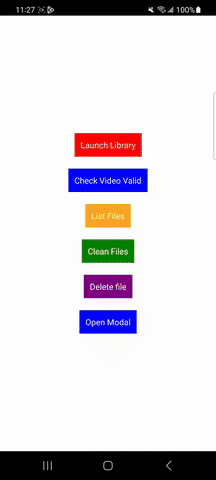
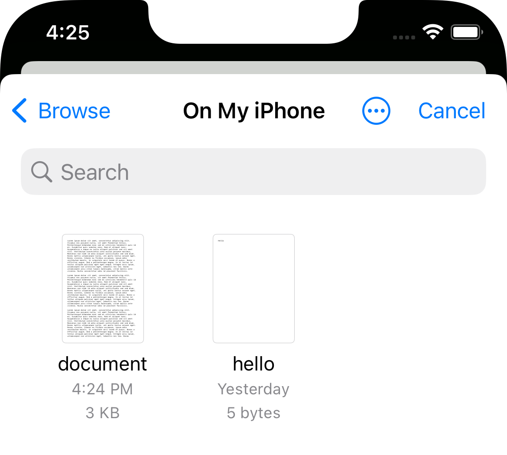
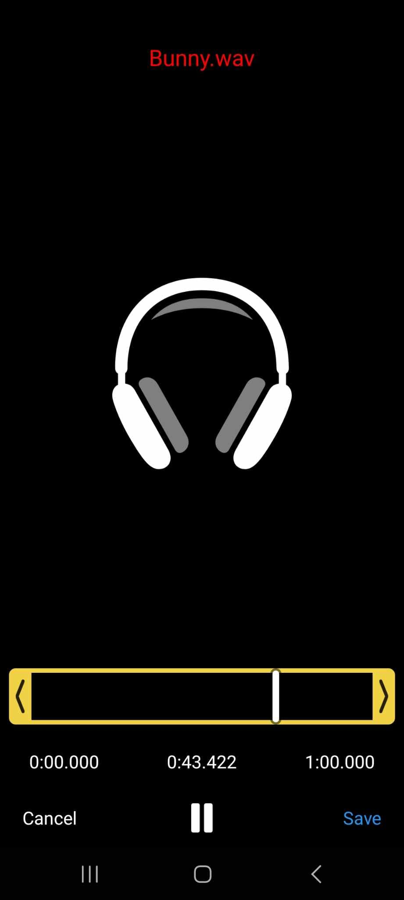
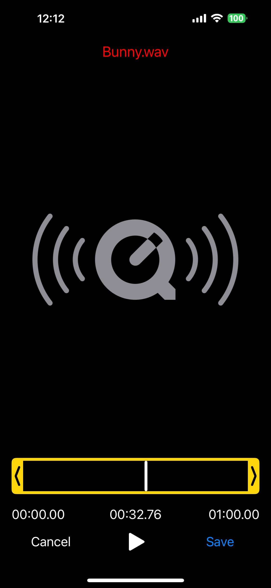
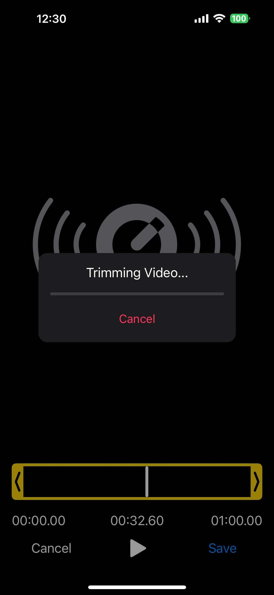
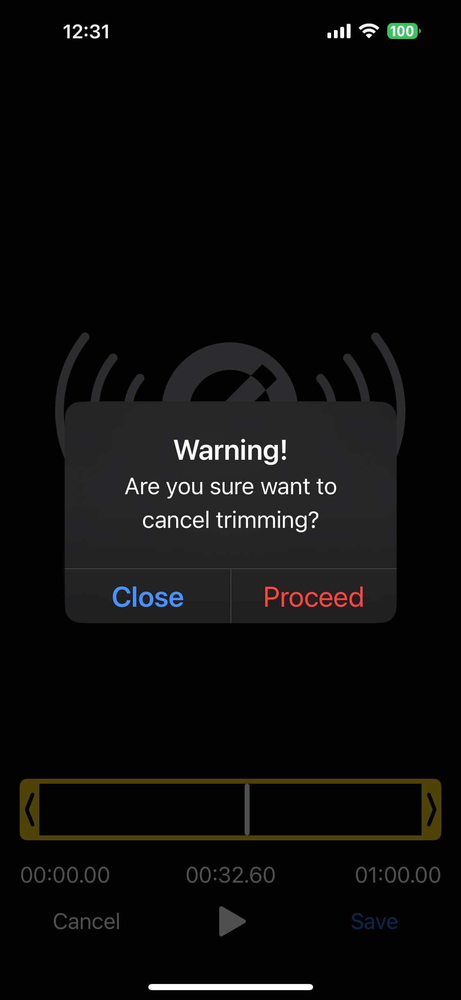
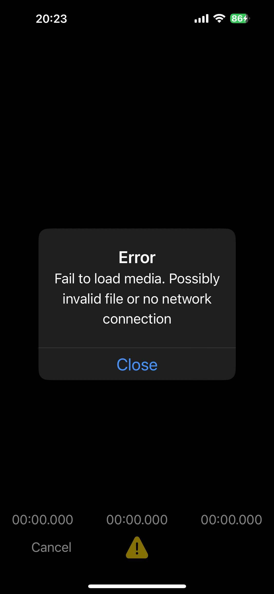

# React Native Video Trim
<div align="center">
<h2>Video trimmer for your React Native app</h2>



</div>

## Features
- ✅ Support video and audio
- ✅ Support local and remote files
- ✅ Save to Photos, Documents and Share to other apps
- ✅ Check if file is valid video/audio
- ✅ File operations: list, clean up, delete specific file

<div align="left">


</div>

## Installation

```sh
npm install react-native-video-trim

# or with yarn

yarn add react-native-video-trim
```
## For iOS (React Native CLI project)
Run the following command to setup for iOS:
```
npx pod-install ios
```
## For Expo project
You need to run `prebuild` in order for native code takes effect:
```
npx expo prebuild

npx pod-install ios
```

## Usage

> [!IMPORTANT]  
> Note that for both Android and iOS you have to try on real device

> [!IMPORTANT]  
> If you plan to trim remote file, you must install FFMPEG version from "https" onwards, "min" version won't work. See bottom to know how to install specific FFMPEG version


```js
import { showEditor } from 'react-native-video-trim';

// ...

showEditor(videoUrl);

// or with output length limit

showEditor(videoUrl, {
  maxDuration: 20,
});
```
Usually this library will be used along with other library to select video file, Eg. [react-native-image-picker](https://github.com/react-native-image-picker/react-native-image-picker). Below is real world example:

```tsx
import * as React from 'react';

import {
  StyleSheet,
  View,
  Text,
  TouchableOpacity,
  NativeEventEmitter,
  NativeModules,
} from 'react-native';
import { isValidFile, showEditor } from 'react-native-video-trim';
import { launchImageLibrary } from 'react-native-image-picker';
import { useEffect } from 'react';

export default function App() {
  useEffect(() => {
    const eventEmitter = new NativeEventEmitter(NativeModules.VideoTrim);
    const subscription = eventEmitter.addListener('VideoTrim', (event) => {
      switch (event.name) {
        case 'onLoad': {
          // on media loaded successfully
          console.log('onLoadListener', event);
          break;
        }
        case 'onShow': {
          console.log('onShowListener', event);
          break;
        }
        case 'onHide': {
          console.log('onHide', event);
          break;
        }
        case 'onStartTrimming': {
          console.log('onStartTrimming', event);
          break;
        }
        case 'onFinishTrimming': {
          console.log('onFinishTrimming', event);
          break;
        }
        case 'onCancelTrimming': {
          console.log('onCancelTrimming', event);
          break;
        }
        case 'onCancel': {
          console.log('onCancel', event);
          break;
        }
        case 'onError': {
          console.log('onError', event);
          break;
        }
        case 'onLog': {
          console.log('onLog', event);
          break;
        }
        case 'onStatistics': {
          console.log('onStatistics', event);
          break;
        }
      }
    });

    return () => {
      subscription.remove();
    };
  }, []);

  return (
    <View style={styles.container}>
      <TouchableOpacity
        onPress={async () => {
          const result = await launchImageLibrary({
            mediaType: 'video',
            assetRepresentationMode: 'current',
          });

          isValidFile(result.assets![0]?.uri || '').then((res) =>
            console.log(res)
          );

          showEditor(result.assets![0]?.uri || '', {
            maxDuration: 20,
          });
        }}
        style={{ padding: 10, backgroundColor: 'red' }}
      >
        <Text>Launch Library</Text>
      </TouchableOpacity>
      <TouchableOpacity
        onPress={() => {
          isValidFile('invalid file path').then((res) => console.log(res));
        }}
        style={{
          padding: 10,
          backgroundColor: 'blue',
          marginTop: 20,
        }}
      >
        <Text>Check Video Valid</Text>
      </TouchableOpacity>
    </View>
  );
}

const styles = StyleSheet.create({
  container: {
    flex: 1,
    alignItems: 'center',
    justifyContent: 'center',
  },
});
```

# Methods

## showEditor(videoPath: string, config?: EditorConfig)
Main method to show Video Editor UI.

*Params*:
- `videoPath`: Path to video file, if this is an invalid path, `onError` event will be fired
- `config` (optional, every sub props of `config` is optional): 
  
  - `type` (`default = video`): which player to use, `video` or `audio`
  - `outputExt` (`default = mp4`): output file extension
  - `enableHapticFeedback` (`default = true`): whether to enable haptic feedback
  - `saveToPhoto` (Video-only, `default = false`): whether to save video to photo/gallery after editing
  - `openDocumentsOnFinish` (`default = false`): open Document Picker on done trimming
  - `openShareSheetOnFinish` (`default = false`): open Share Sheet on done trimming
  - `removeAfterSavedToPhoto` (`default = false`): whether to remove output file from storage after saved to Photo successfully
  - `removeAfterFailedToSavePhoto` (`default = false`): whether to remove output file if fail to save to Photo
  - `removeAfterSavedToDocuments` (`default = false`): whether to remove output file from storage after saved Documents successfully
  - `removeAfterFailedToSaveDocuments` (`default = false`): whether to remove output file from storage after fail to save to Documents
  - `removeAfterShared` (`default = false`): whether to remove output file from storage after saved Share successfully. iOS only, on Android you'll have to manually remove the file (this is because on Android there's no way to detect when sharing is successful)
  - `removeAfterFailedToShare` (`default = false`): whether to remove output file from storage after fail to Share. iOS only, on Android you'll have to manually remove the file
  - `maxDuration` (optional): maximum duration for the trimmed video
  - `minDuration` (`default = 1000`): minimum duration for the trimmed video
  - `cancelButtonText` (`default= "Cancel"`): text of left button in Editor dialog
  - `saveButtonText` (`default= "Save"`): text of right button in Editor dialog
  - `enableCancelDialog` (`default = true`): whether to show alert dialog on press Cancel
  - `cancelDialogTitle` (`default = "Warning!"`)
  - `cancelDialogMessage` (`default = "Are you sure want to cancel?"`)
  - `cancelDialogCancelText` (`default = "Close"`)
  - `cancelDialogConfirmText` (`default = "Proceed"`)
  - `enableSaveDialog` (`default = true`): whether to show alert dialog on press Save
  - `saveDialogTitle` (`default = "Confirmation!"`)
  - `saveDialogMessage` (`default = "Are you sure want to save?"`)
  - `saveDialogCancelText` (`default = "Close"`)
  - `saveDialogConfirmText` (`default = "Proceed"`)
  - `fullScreenModalIOS` (`default = false`): whether to open editor in fullscreen modal
  - `trimmingText` (`default = "Trimming video..."`): trimming text on the progress dialog
  - `autoplay` (`default = false`): whether to autoplay media on load
  - `jumpToPositionOnLoad` (optional): which time position should jump on media loaded (millisecond)
  - `closeWhenFinish` (`default = true`): should editor close on finish trimming
  - `enableCancelTrimming` (`default = true`): enable cancel trimming
  - `cancelTrimmingButtonText` (`default = "Cancel"`)
  - `enableCancelTrimmingDialog` (`default = true`)
  - `cancelTrimmingDialogTitle` (`default = "Warning!"`)
  - `cancelTrimmingDialogMessage` (`default = "Are you sure want to cancel trimming?"`)
  - `cancelTrimmingDialogCancelText` (`default = "Close"`)
  - `cancelTrimmingDialogConfirmText` (`default = "Proceed"`)
  - `headerText` (optional)
  - `headerTextSize` (`default = 16`)
  - `headerTextColor` (`default = white`)
  - `alertOnFailToLoad` (`default = true`)
  - `alertOnFailTitle` (`default = "Error"`)
  - `alertOnFailMessage` (`default = "Fail to load media. Possibly invalid file or no network connection"`)
  - `alertOnFailCloseText` (`default = "Close"`)

If `saveToPhoto = true`, you must ensure that you have request permission to write to photo/gallery
- For Android: you need to have `<uses-permission android:name="android.permission.WRITE_EXTERNAL_STORAGE" />` in AndroidManifest.xml
- For iOS: you need `NSPhotoLibraryUsageDescription` in Info.plist

If `openShareSheetOnFinish=true`, on Android you'll need to update `AndroidManifest.xml` like below:
```xml
</application>
  ...
  <provider
    android:name="androidx.core.content.FileProvider"
    android:authorities="${applicationId}.provider"
    android:exported="false"
    android:grantUriPermissions="true">
    <meta-data
      android:name="android.support.FILE_PROVIDER_PATHS"
      android:resource="@xml/file_paths" />
  </provider>
</application>
```

If you face issue when building Android app related to `file_paths`, then you may need to create `res/xml/file_paths.xml`: with the following content:
```xml
<?xml version="1.0" encoding="utf-8"?>
<paths xmlns:android="http://schemas.android.com/apk/res/android">
  <files-path name="internal_files" path="." />
  <external-path name="external_files" path="." />
</paths>
```

## isValidFile(videoPath: string)

This method is to check if a path is a valid video/audio

## closeEditor()

Close Editor

## listFiles()
Return array of generated output files in app storage. (`Promise<string[]>`)

## cleanFiles()
Clean all generated output files in app storage. Return number of successfully deleted files (`Promise<number>`)

## deleteFile()
Delete a file in app storage. Return `true` if success

# Events
To listen for events you interest, do the following:
```js
useEffect(() => {
  const eventEmitter = new NativeEventEmitter(NativeModules.VideoTrim);
  const subscription = eventEmitter.addListener('VideoTrim', (event) => {
    switch (event.name) {
      case 'onLoad': {
        console.log('onLoadListener', event);
        break;
      }
      case 'onShow': {
        console.log('onShowListener', event);
        break;
      }
      case 'onHide': {
        console.log('onHide', event);
        break;
      }
      case 'onStartTrimming': {
        console.log('onStartTrimming', event);
        break;
      }
      case 'onFinishTrimming': {
        console.log('onFinishTrimming', event);
        break;
      }
      case 'onCancelTrimming': {
        console.log('onCancelTrimming', event);
        break;
      }
      case 'onCancel': {
        console.log('onCancel', event);
        break;
      }
      case 'onError': {
        console.log('onError', event);
        break;
      }
      case 'onLog': {
        console.log('onLog', event);
        break;
      }
      case 'onStatistics': {
        console.log('onStatistics', event);
        break;
      }
    }
  });

  return () => {
    subscription.remove();
  };
}, []);
```
# Audio support
<div align="left">


</div>

For audio only you have to pass `type=audio` and `outputExt`:
```ts
showEditor(url, {
  type: 'audio', // important
  outputExt: 'wav', // important: any audio type for output file extension
})
```

You must install FFMPEG version from "https" onwards, "min" version won't work. Eg.
```gradle
// Android: android/build.gradle > buildscript > ext

buildscript {
    ext {
        ffmpegKitPackage = "full"
    }

---
// iOS:

FFMPEGKIT_PACKAGE=https npx pod-install ios

// or

FFMPEGKIT_PACKAGE=https pod install
```

# Cancel trimming
<div align="left">


</div>

While trimming, you can press Cancel to terminate the process.

Related props: `enableCancelTrimming, cancelTrimmingButtonText, enableCancelTrimmingDialog, cancelTrimmingDialogTitle, cancelTrimmingDialogMessage, cancelTrimmingDialogCancelText, cancelTrimmingDialogConfirmText`

# Fail to load media


If there's error while loading media, there'll be a prompt

Related props: `alertOnFailToLoad, alertOnFailTitle, alertOnFailMessage, alertOnFailCloseText`

# Customize FFMPEG version
This library uses FFMPEG-Kit Android under the hood, by default FFMPEG `min` is used, which gives smallest bundle size. To customize the package version please see below

## Android
If you ever need to use other version of FFMPEG-Kit for Android, you can do the following, in your `android/build.gradle` > `buildscript` > `ext`:

```gradle
buildscript {
    ext {
        ffmpegKitPackage = "full" // default "min"

        ffmpegKitPackageVersion = "5.1.LTS" // default 6.0-2
    }
```

## iOS
Same as Android, there're 2 environment variables respectively you can use to specify FFMPEG Kit version you want to use: `FFMPEG_KIT_PACKAGE` and `FFMPEG_KIT_PACKAGE_VERSION`.

You need to pass the variables when running pod install. Eg:
```shell
# override package name, default: min
FFMPEGKIT_PACKAGE=full npx pod-install ios

# override package version, default: '~> 6.0
FFMPEGKIT_PACKAGE_VERSION=5.1 npx pod-install ios

# or both
FFMPEGKIT_PACKAGE=full FFMPEGKIT_PACKAGE_VERSION=5.1 npx pod-install ios
```

If you use anything other than `https` ensure you have this added to your pod spec
```
pod 'ffmpeg-kit-react-native', :subspecs => ['full'], :podspec => '../node_modules/ffmpeg-kit-react-native/ffmpeg-kit-react-native.podspec'

# or even better
pod 'ffmpeg-kit-react-native', :subspecs => [ENV['FFMPEGKIT_PACKAGE']], :podspec => '../node_modules/ffmpeg-kit-react-native/ffmpeg-kit-react-native.podspec'
```

## Packages

<table>
<thead>
<tr>
<th align="center"></th>
<th align="center"><sup>min</sup></th>
<th align="center"><sup>min-gpl</sup></th>
<th align="center"><sup>https</sup></th>
<th align="center"><sup>https-gpl</sup></th>
<th align="center"><sup>audio</sup></th>
<th align="center"><sup>video</sup></th>
<th align="center"><sup>full</sup></th>
<th align="center"><sup>full-gpl</sup></th>
</tr>
</thead>
<tbody>
<tr>
<td align="center"><sup>external libraries</sup></td>
<td align="center">-</td>
<td align="center"><sup>vid.stab</sup><br><sup>x264</sup><br><sup>x265</sup><br><sup>xvidcore</sup></td>
<td align="center"><sup>gmp</sup><br><sup>gnutls</sup></td>
<td align="center"><sup>gmp</sup><br><sup>gnutls</sup><br><sup>vid.stab</sup><br><sup>x264</sup><br><sup>x265</sup><br><sup>xvidcore</sup></td>
<td align="center"><sup>lame</sup><br><sup>libilbc</sup><br><sup>libvorbis</sup><br><sup>opencore-amr</sup><br><sup>opus</sup><br><sup>shine</sup><br><sup>soxr</sup><br><sup>speex</sup><br><sup>twolame</sup><br><sup>vo-amrwbenc</sup></td>
<td align="center"><sup>dav1d</sup><br><sup>fontconfig</sup><br><sup>freetype</sup><br><sup>fribidi</sup><br><sup>kvazaar</sup><br><sup>libass</sup><br><sup>libiconv</sup><br><sup>libtheora</sup><br><sup>libvpx</sup><br><sup>libwebp</sup><br><sup>snappy</sup><br><sup>zimg</sup></td>
<td align="center"><sup>dav1d</sup><br><sup>fontconfig</sup><br><sup>freetype</sup><br><sup>fribidi</sup><br><sup>gmp</sup><br><sup>gnutls</sup><br><sup>kvazaar</sup><br><sup>lame</sup><br><sup>libass</sup><br><sup>libiconv</sup><br><sup>libilbc</sup><br><sup>libtheora</sup><br><sup>libvorbis</sup><br><sup>libvpx</sup><br><sup>libwebp</sup><br><sup>libxml2</sup><br><sup>opencore-amr</sup><br><sup>opus</sup><br><sup>shine</sup><br><sup>snappy</sup><br><sup>soxr</sup><br><sup>speex</sup><br><sup>twolame</sup><br><sup>vo-amrwbenc</sup><br><sup>zimg</sup></td>
<td align="center"><sup>dav1d</sup><br><sup>fontconfig</sup><br><sup>freetype</sup><br><sup>fribidi</sup><br><sup>gmp</sup><br><sup>gnutls</sup><br><sup>kvazaar</sup><br><sup>lame</sup><br><sup>libass</sup><br><sup>libiconv</sup><br><sup>libilbc</sup><br><sup>libtheora</sup><br><sup>libvorbis</sup><br><sup>libvpx</sup><br><sup>libwebp</sup><br><sup>libxml2</sup><br><sup>opencore-amr</sup><br><sup>opus</sup><br><sup>shine</sup><br><sup>snappy</sup><br><sup>soxr</sup><br><sup>speex</sup><br><sup>twolame</sup><br><sup>vid.stab</sup><br><sup>vo-amrwbenc</sup><br><sup>x264</sup><br><sup>x265</sup><br><sup>xvidcore</sup><br><sup>zimg</sup></td>
</tr>
<tr>
<td align="center"><sup>android system libraries</sup></td>
<td align="center" colspan=8><sup>zlib</sup><br><sup>MediaCodec</sup></td>
</tr>
<tr>
<td align="center"><sup>ios system libraries</sup></td>
<td align="center" colspan=8><sup>bzip2</sup><br><sup>AudioToolbox</sup><br><sup>AVFoundation</sup><br><sup>iconv</sup><br><sup>VideoToolbox</sup><br><sup>zlib</sup></td>
</tr>
<tr>
<tr>
<td align="center"><sup>macos system libraries</sup></td>
<td align="center" colspan=8><sup>bzip2</sup><br><sup>AudioToolbox</sup><br><sup>AVFoundation</sup><br><sup>Core Image</sup><br><sup>iconv</sup><br><sup>OpenCL</sup><br><sup>OpenGL</sup><br><sup>VideoToolbox</sup><br><sup>zlib</sup></td>
</tr>
<tr>
<td align="center"><sup>tvos system libraries</sup></td>
<td align="center" colspan=8><sup>bzip2</sup><br><sup>AudioToolbox</sup><br><sup>iconv</sup><br><sup>VideoToolbox</sup><br><sup>zlib</sup></td>
</tr>
</tbody>
</table>


# Android: update SDK version
You can override sdk version to use any version in your `android/build.gradle` > `buildscript` > `ext`
```gradle
buildscript {
    ext {
        VideoTrim_compileSdkVersion = 34
        VideoTrim_minSdkVersion = 26
        VideoTrim_targetSdkVersion = 34
    }
}
```

# Naming conflict with `ffmpeg-kit-react-native`
This issue is due to this package and `ffmpeg-kit-react-native` share FFMPEG Kit under the hood. To fix it we need to synchronize the FFMPEG Kit version of the 2 packages.

First find out exactly FFMPEG Kit version that `ffmpeg-kit-react-native` is using. By default (if you don't change), the ffmpeg package is `https` ([check here](https://github.com/arthenica/ffmpeg-kit/blob/main/react-native/ffmpeg-kit-react-native.podspec#L19)) and version is `version` in [package.json](https://github.com/arthenica/ffmpeg-kit/blob/main/react-native/package.json#L3)

When you know the package name + version, simply follow the section [Customize FFMPEG version](#customize-ffmpeg-version) in this doc

# Thanks
- Android part is created by modified + fix bugs from: https://github.com/iknow4/Android-Video-Trimmer
- iOS UI is created from: https://github.com/AndreasVerhoeven/VideoTrimmerControl
