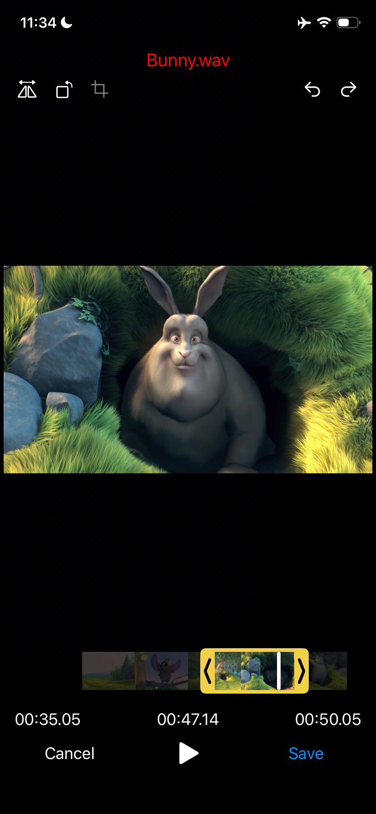
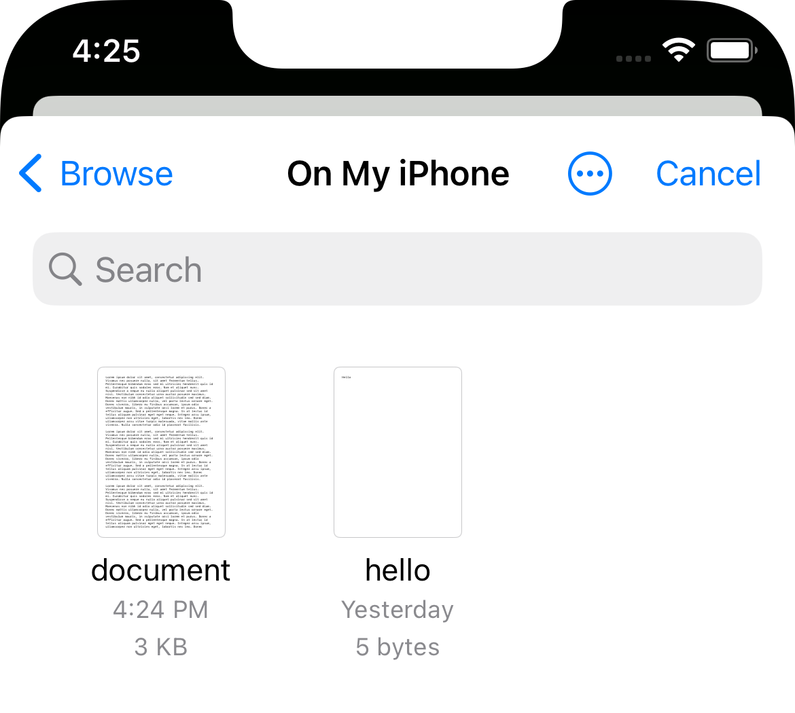
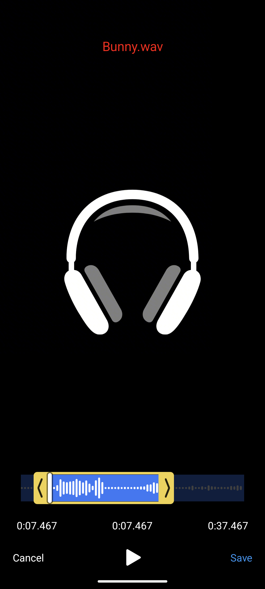
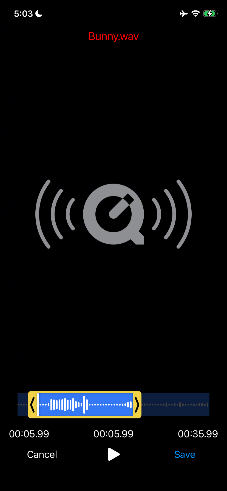
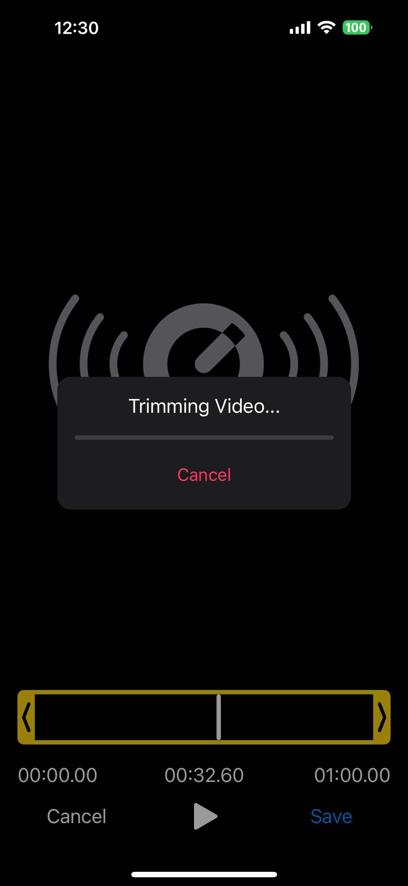
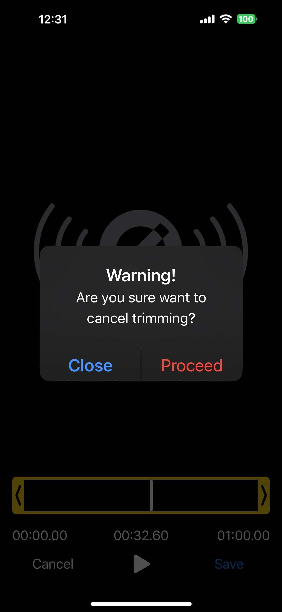
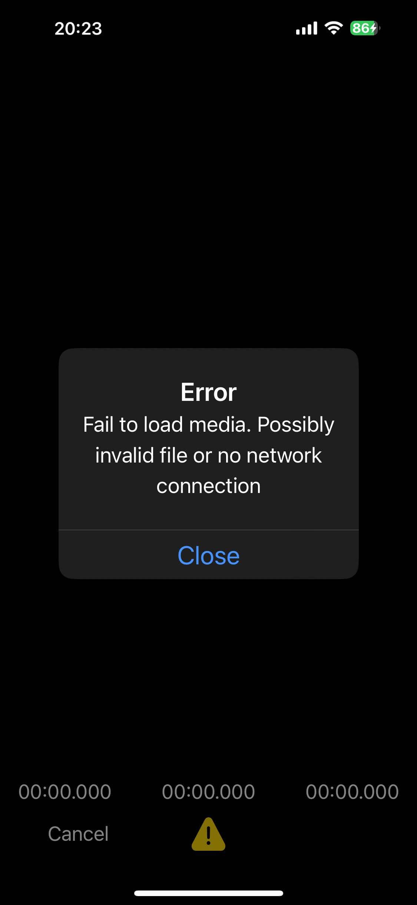

# Table of Contents
- [Overview](#overview)
- [Installation](#installation)
- [Quick Start](#quick-start)
- [API Reference](#api-reference)
  * [showEditor()](#showeditor)
  * [trim()](#trim)
  * [getFrameAt()](#getframeat)
  * [extractAudio()](#extractaudio)
  * [compress()](#compress)
  * [toGif()](#togif)
  * [merge()](#merge)
  * [Utility Functions](#utility-functions)
  * [File Management](#file-management)
- [Configuration Options](#configuration-options)
  * [Basic Options](#basic-options)
  * [UI Customization](#ui-customization)
  * [Behavior Options](#behavior-options)
- [Platform Setup](#platform-setup)
- [Advanced Features](#advanced-features)
  * [Mute Audio / Remove Audio](#mute-audio--remove-audio)
  * [Speed Adjustment](#speed-adjustment)
  * [Theming](#theming)
  * [Audio Trimming](#audio-trimming)
  * [Remote Files (HTTPS)](#remote-files-https)
  * [Video Transforms (Flip, Rotate, Crop)](#video-transforms-flip-rotate-crop)
  * [Precise Frame Trimming](#precise-frame-trimming)
- [Examples](#examples)
- [Troubleshooting](#troubleshooting)

# React Native Video Trim

<div align="center">
  <h2>📱 Professional video trimmer for React Native apps</h2>
  
  
  
  <p>
    <strong>✅ iOS & Android</strong> • 
    <strong>✅ New & Old Architecture</strong> • 
    <strong>✅ Expo Compatible</strong>
  </p>
</div>

## Overview

A powerful, easy-to-use video and audio trimming library for React Native applications.

### ✨ Key Features

- **📹 Video & Audio Support** - Trim both video and audio files with waveform visualization
- **🔄 Flip, Rotate & Crop** - Built-in video transforms with undo/redo support
- **🎯 Precise Trimming** - Optional frame-accurate cuts via hardware-accelerated re-encoding
- **🔇 Mute / Remove Audio** - Strip audio track via editor toggle or headless option
- **⏩ Speed Adjustment** - Change playback speed (0.25x–4x) in editor or headless
- **🗜️ Video Compression** - Reduce file size with quality presets or custom bitrate/resolution
- **🖼️ Frame Extraction** - Extract a single frame as JPEG/PNG at any timestamp
- **🎵 Extract Audio** - Pull the audio track out of a video file
- **🎞️ GIF Conversion** - Convert a video segment to an animated GIF
- **🔗 Video Merge** - Concatenate multiple clips into a single file (headless)
- **🌐 Local & Remote Files** - Support for local storage and HTTPS URLs
- **💾 Multiple Save Options** - Photos, Documents, or Share to other apps
- **✅ File Validation** - Built-in validation for media files
- **🗂️ File Management** - List, clean up, and delete specific files
- **🔄 Universal Architecture** - Works with both New and Old React Native architectures
- **🎨 Dark & Light Theme** - Built-in dark and light theme support

### 🎛️ Core Capabilities

| Feature | Description |
|---------|-------------|
| **Trimming** | Video/audio trimming with visual timeline controls and audio waveform |
| **Transforms** | Horizontal flip, 90° rotation, and freeform crop with undo/redo |
| **Precise Trimming** | Frame-accurate cuts using hardware re-encoding (opt-in) |
| **Mute Audio** | Strip audio track from output — editor toggle + headless option |
| **Speed Control** | 0.25x–4x playback speed — editor selector + headless option |
| **Compression** | Reduce file size via quality presets or custom bitrate/resolution |
| **Frame Extraction** | Extract a single frame as JPEG/PNG at a given timestamp |
| **Audio Extraction** | Extract the audio track from a video into a separate file |
| **GIF Conversion** | Convert a video segment to an animated GIF with palette optimization |
| **Video Merge** | Concatenate multiple clips into one file (headless API) |
| **Validation** | Check if files are valid video/audio before processing |
| **Save Options** | Photos, Documents, Share sheet integration |
| **File Management** | Complete file lifecycle management |
| **Customization** | Extensive UI and behavior customization |
| **Theming** | Dark and light theme with automatic color adaptation |

<div align="center">
  
  
</div>

## Installation

```bash
npm install react-native-video-trim
# or
yarn add react-native-video-trim
```

### Platform Setup

<details>
<summary><strong>📱 iOS Setup (React Native CLI)</strong></summary>

```bash
npx pod-install ios
```

**Permissions Required:**
- For saving to Photos: Add `NSPhotoLibraryUsageDescription` to `Info.plist`
</details>

<details>
<summary><strong>🤖 Android Setup (React Native CLI)</strong></summary>

**For New Architecture:**
```bash
cd android && ./gradlew generateCodegenArtifactsFromSchema
```

**Permissions Required:**
- For saving to Photos: Add to `AndroidManifest.xml`:
```xml
<uses-permission android:name="android.permission.WRITE_EXTERNAL_STORAGE" />
```

**For Share Sheet functionality**, add to `AndroidManifest.xml`:
```xml
<application>
  <!-- your other configs -->
  
  <provider
    android:name="androidx.core.content.FileProvider"
    android:authorities="${applicationId}.provider"
    android:exported="false"
    android:grantUriPermissions="true">
    <meta-data
      android:name="android.support.FILE_PROVIDER_PATHS"
      android:resource="@xml/file_paths" />
  </provider>
</application>
```

Create `android/app/src/main/res/xml/file_paths.xml`:
```xml
<?xml version="1.0" encoding="utf-8"?>
<paths xmlns:android="http://schemas.android.com/apk/res/android">
  <files-path name="internal_files" path="." />
  <cache-path name="cache_files" path="." />
  <external-path name="external_files" path="." />
</paths>
```
</details>

<details>
<summary><strong>🔧 Expo Setup</strong></summary>

```bash
npx expo prebuild
```

Then rebuild your app. **Note:** Expo Go may not work due to native dependencies - use development builds or `expo run:ios`/`expo run:android`.
</details>

## Quick Start

Get up and running in 3 simple steps:

```javascript
import { showEditor } from 'react-native-video-trim';

// 1. Basic usage - open video editor
showEditor(videoUrl);

// 2. With duration limit
showEditor(videoUrl, {
  maxDuration: 20,
});

// 3. With save options
showEditor(videoUrl, {
  maxDuration: 30,
  saveToPhoto: true,
  openShareSheetOnFinish: true,
});
```

### Complete Example with File Picker

```javascript
import { showEditor } from 'react-native-video-trim';
import { launchImageLibrary } from 'react-native-image-picker';

const trimVideo = () => {
  // Pick a video
  launchImageLibrary({ mediaType: 'video' }, (response) => {
    if (response.assets && response.assets[0]) {
      const videoUri = response.assets[0].uri;
      
      // Open editor
      showEditor(videoUri, {
        maxDuration: 60, // 60 seconds max
        saveToPhoto: true,
      });
    }
  });
};
```

> 💡 **More Examples:** Check the [example folder](./example/src/) for complete implementation details with event listeners for both New and Old architectures.

## API Reference

### showEditor()

Opens the video trimmer interface.

```typescript
showEditor(videoPath: string, config?: EditorConfig): void
```

**Parameters:**
- `videoPath` (string): Path to video file (local or remote HTTPS URL)
- `config` (EditorConfig, optional): Configuration options (see [Configuration Options](#configuration-options))

**Example:**
```javascript
showEditor('/path/to/video.mp4', {
  maxDuration: 30,
  saveToPhoto: true,
});
```

### trim()

Programmatically trim a video without showing the UI.

```typescript
trim(url: string, options: TrimOptions): Promise<TrimResult>
```

**Returns:** Promise resolving to the TrimResult interface

**Example:**
```javascript
const outputPath = await trim('/path/to/video.mp4', {
  startTime: 5000,  // 5 seconds
  endTime: 25000,   // 25 seconds
});
```

### getFrameAt()

Extract a single video frame as a JPEG or PNG image.

```typescript
getFrameAt(url: string, options?: Partial<FrameExtractionOptions>): Promise<FrameResult>
```

**Options:**

| Option | Type | Default | Description |
|--------|------|---------|-------------|
| `time` | `number` | `0` | Timestamp in milliseconds |
| `format` | `string` | `"jpeg"` | Output format: `"jpeg"` or `"png"` |
| `quality` | `number` | `80` | JPEG quality (0–100). Ignored for PNG |
| `maxWidth` | `number` | `-1` | Max width in pixels (`-1` for original) |
| `maxHeight` | `number` | `-1` | Max height in pixels (`-1` for original) |

**Example:**
```javascript
import { getFrameAt } from 'react-native-video-trim';

const { outputPath } = await getFrameAt('/path/to/video.mp4', {
  time: 5000,       // 5 seconds
  format: 'jpeg',
  quality: 90,
  maxWidth: 640,
});
```

### extractAudio()

Extract the audio track from a video file into a separate audio file.

```typescript
extractAudio(url: string, options?: Partial<ExtractAudioOptions>): Promise<ExtractAudioResult>
```

**Options:**

| Option | Type | Default | Description |
|--------|------|---------|-------------|
| `outputExt` | `string` | `"m4a"` | Output format: `"m4a"`, `"wav"`, `"mp3"` (requires FFmpegKit with libmp3lame), etc. |

**Returns:** `{ outputPath: string, duration: number }` (duration in milliseconds)

**Example:**
```javascript
import { extractAudio } from 'react-native-video-trim';

const { outputPath, duration } = await extractAudio('/path/to/video.mp4', {
  outputExt: 'm4a',
});
```

### compress()

Compress a video file to reduce its size.

```typescript
compress(url: string, options?: Partial<CompressOptions>): Promise<CompressResult>
```

**Options:**

| Option | Type | Default | Description |
|--------|------|---------|-------------|
| `quality` | `string` | `"medium"` | Preset: `"low"`, `"medium"`, or `"high"` |
| `bitrate` | `number` | `-1` | Explicit bitrate in bps. Overrides `quality` when set |
| `width` | `number` | `-1` | Target width (`-1` to keep original) |
| `height` | `number` | `-1` | Target height (`-1` to keep original) |
| `frameRate` | `number` | `-1` | Target frame rate (`-1` to keep original) |
| `outputExt` | `string` | `"mp4"` | Output file extension |
| `removeAudio` | `boolean` | `false` | Strip audio from the output |

**Example:**
```javascript
import { compress } from 'react-native-video-trim';

// Quality preset
const { outputPath } = await compress('/path/to/video.mp4', {
  quality: 'medium',
});

// Custom settings
const { outputPath } = await compress('/path/to/video.mp4', {
  width: 720,
  bitrate: 2_000_000,
  removeAudio: true,
});
```

### toGif()

Convert a video segment to an animated GIF using FFmpeg's palette-based encoding for good quality.

```typescript
toGif(url: string, options?: Partial<GifOptions>): Promise<GifResult>
```

**Options:**

| Option | Type | Default | Description |
|--------|------|---------|-------------|
| `startTime` | `number` | `0` | Start time in milliseconds |
| `endTime` | `number` | `-1` | End time in milliseconds (`-1` for end of video) |
| `fps` | `number` | `10` | Frame rate of the GIF |
| `width` | `number` | `-1` | Width in pixels (`-1` for original). Height auto-scales |

**Example:**
```javascript
import { toGif } from 'react-native-video-trim';

const { outputPath } = await toGif('/path/to/video.mp4', {
  startTime: 2000,
  endTime: 7000,
  fps: 15,
  width: 320,
});
```

### merge()

Concatenate multiple media files into a single file. Headless only (no editor UI).

```typescript
merge(urls: string[], options?: Partial<MergeOptions>): Promise<MergeResult>
```

**Options:**

| Option | Type | Default | Description |
|--------|------|---------|-------------|
| `outputExt` | `string` | `"mp4"` | Output file extension |

**Returns:** `{ outputPath: string, duration: number }` (duration in milliseconds)

> **Note:** Merge uses FFmpeg's concat filter with hardware-accelerated re-encoding (h264_videotoolbox on iOS, h264_mediacodec on Android). Input clips can have different codecs, resolutions, or frame rates — each input is automatically scaled, padded (letterboxed/pillarboxed), and frame-rate-normalized to match the first clip's dimensions and fps (capped at 30 fps). The output bitrate matches the highest-quality input to preserve quality.
>
> **Limitation:** Only **local file paths** are supported. Remote URLs are not supported because the default FFmpegKit build does not include OpenSSL.

**Example:**
```javascript
import { merge } from 'react-native-video-trim';

const { outputPath, duration } = await merge([
  '/path/to/clip1.mp4',
  '/path/to/clip2.mp4',
  '/path/to/clip3.mp4',
]);
```

### Utility Functions

Standalone functions for saving, sharing, or exporting any output file. These work with output from any API (`compress`, `toGif`, `merge`, `trim`, etc.).

| Method | Description | Returns |
|--------|-------------|---------|
| `saveToPhoto(filePath)` | Save a file to the device's photo library (requires permission) | `Promise<SaveToPhotoResult>` |
| `saveToDocuments(filePath)` | Open the system document picker to save a file | `Promise<SaveToDocumentsResult>` |
| `share(filePath)` | Open the system share sheet for a file | `Promise<ShareResult>` |

**Examples:**
```javascript
import { compress, saveToPhoto, share, deleteFile } from 'react-native-video-trim';

// Compress then save to photo library
const { outputPath } = await compress('/path/to/video.mp4', { quality: 'medium' });
await saveToPhoto(outputPath);
await deleteFile(outputPath);

// Merge then share
const { outputPath: merged } = await merge(['/clip1.mp4', '/clip2.mp4']);
await share(merged);
```

> **Note:** Headless API outputs (`getFrameAt`, `extractAudio`, `compress`, `toGif`, `merge`) are written to the **cache directory**, which the OS may purge under storage pressure when your app is not running. Files from `showEditor` and `trim` are written to the persistent documents directory. For all outputs, call `deleteFile(outputPath)` when you are done with the file, or use `cleanFiles()` periodically to free space.

### File Management

| Method | Description | Returns |
|--------|-------------|---------|
| `isValidFile(videoPath)` | Check if file is valid video/audio | `Promise<boolean>` |
| `listFiles()` | List all generated output files | `Promise<string[]>` |
| `cleanFiles()` | Delete all generated files | `Promise<number>` |
| `deleteFile(filePath)` | Delete specific file | `Promise<boolean>` |
| `closeEditor()` | Close the editor interface | `void` |

**Examples:**
```javascript
// Validate file before processing
const isValid = await isValidFile('/path/to/video.mp4');
if (!isValid) {
  console.log('Invalid video file');
  return;
}

// Clean up generated files
const deletedCount = await cleanFiles();
console.log(`Deleted ${deletedCount} files`);
```

## Configuration Options

All configuration options are optional. Here are the most commonly used ones:

### Basic Options

| Option | Type | Default | Description |
|--------|------|---------|-------------|
| `type` | `'video' \| 'audio'` | `'video'` | Media type to trim |
| `outputExt` | `string` | `'mp4'` | Output file extension |
| `maxDuration` | `number` | `video duration` | Maximum duration in milliseconds |
| `minDuration` | `number` | `1000` | Minimum duration in milliseconds |
| `autoplay` | `boolean` | `false` | Auto-play media on load |
| `jumpToPositionOnLoad` | `number` | - | Initial position in milliseconds |
| `removeAudio` | `boolean` | `false` | Strip the audio track from the output (see [Mute Audio](#mute-audio--remove-audio)) |
| `speed` | `number` | `1.0` | Playback speed multiplier (0.25–4.0). Forces re-encoding when ≠ 1.0 (see [Speed Adjustment](#speed-adjustment)) |

### Save & Share Options

| Option | Type | Default | Description |
|--------|------|---------|-------------|
| `saveToPhoto` | `boolean` | `false` | Save to photo gallery (requires permissions) |
| `openDocumentsOnFinish` | `boolean` | `false` | Open document picker when done |
| `openShareSheetOnFinish` | `boolean` | `false` | Open share sheet when done |
| `removeAfterSavedToPhoto` | `boolean` | `false` | Delete file after saving to photos |
| `removeAfterFailedToSavePhoto` | `boolean` | `false` | Delete file if saving to photos fails |
| `removeAfterSavedToDocuments` | `boolean` | `false` | Delete file after saving to documents |
| `removeAfterFailedToSaveDocuments` | `boolean` | `false` | Delete file if saving to documents fails |
| `removeAfterShared` | `boolean` | `false` | Delete file after sharing (iOS only) |
| `removeAfterFailedToShare` | `boolean` | `false` | Delete file if sharing fails (iOS only) |

### UI Customization

| Option | Type | Default | Description |
|--------|------|---------|-------------|
| `theme` | `'dark' \| 'light'` | `'dark'` | Editor color theme (see [Theming](#theming)) |
| `durationFormat` | `'mm:ss' \| 'mm:ss.SS' \| 'mm:ss.SSS' \| 'hh:mm:ss' \| 'hh:mm:ss.SSS'` | `'mm:ss.SSS'` | Format of the start / current / end time labels in the editor. Use `'mm:ss'` to hide milliseconds. Unknown values fall back to the default. Only affects on-screen labels; event payloads still report raw milliseconds. |
| `cancelButtonText` | `string` | `"Cancel"` | Cancel button text |
| `saveButtonText` | `string` | `"Save"` | Save button text |
| `trimmingText` | `string` | `"Trimming video..."` | Progress dialog text |
| `headerText` | `string` | - | Header text |
| `headerTextSize` | `number` | `16` | Header text size |
| `headerTextColor` | `string` | - | Header text color (defaults to black in light theme, white in dark theme) |
| `trimmerColor` | `string` | - | Trimmer bar color |
| `handleIconColor` | `string` | - | Trimmer left/right handles color (defaults to black in light theme, white in dark theme) |
| `fullScreenModalIOS` | `boolean` | `false` | Use fullscreen modal on iOS |

### Audio Waveform Options

These options only apply when `type: 'audio'`. The waveform replaces the thumbnail track with a bar visualization of the audio amplitude.

| Option | Type | Default | Description |
|--------|------|---------|-------------|
| `waveformColor` | `string` | `"white"` | Fill color of the waveform bars |
| `waveformBackgroundColor` | `string` | `"#3478F6"` | Background color behind the bars |
| `waveformBarWidth` | `number` | `3` | Width of each bar in dp/pt |
| `waveformBarGap` | `number` | `2` | Gap between bars in dp/pt |
| `waveformBarCornerRadius` | `number` | `1.5` | Corner radius of each bar in dp/pt |

### Dialog Options

<details>
<summary><strong>Cancel Dialog</strong></summary>

| Option | Type | Default | Description |
|--------|------|---------|-------------|
| `enableCancelDialog` | `boolean` | `true` | Show confirmation dialog on cancel |
| `cancelDialogTitle` | `string` | `"Warning!"` | Cancel dialog title |
| `cancelDialogMessage` | `string` | `"Are you sure want to cancel?"` | Cancel dialog message |
| `cancelDialogCancelText` | `string` | `"Close"` | Cancel dialog cancel button text |
| `cancelDialogConfirmText` | `string` | `"Proceed"` | Cancel dialog confirm button text |
</details>

<details>
<summary><strong>Save Dialog</strong></summary>

| Option | Type | Default | Description |
|--------|------|---------|-------------|
| `enableSaveDialog` | `boolean` | `true` | Show confirmation dialog on save |
| `saveDialogTitle` | `string` | `"Confirmation!"` | Save dialog title |
| `saveDialogMessage` | `string` | `"Are you sure want to save?"` | Save dialog message |
| `saveDialogCancelText` | `string` | `"Close"` | Save dialog cancel button text |
| `saveDialogConfirmText` | `string` | `"Proceed"` | Save dialog confirm button text |
</details>

<details>
<summary><strong>Trimming Cancel Dialog</strong></summary>

| Option | Type | Default | Description |
|--------|------|---------|-------------|
| `enableCancelTrimming` | `boolean` | `true` | Enable cancel during trimming |
| `cancelTrimmingButtonText` | `string` | `"Cancel"` | Cancel trimming button text |
| `enableCancelTrimmingDialog` | `boolean` | `true` | Show cancel trimming confirmation |
| `cancelTrimmingDialogTitle` | `string` | `"Warning!"` | Cancel trimming dialog title |
| `cancelTrimmingDialogMessage` | `string` | `"Are you sure want to cancel trimming?"` | Cancel trimming dialog message |
| `cancelTrimmingDialogCancelText` | `string` | `"Close"` | Cancel trimming dialog cancel button |
| `cancelTrimmingDialogConfirmText` | `string` | `"Proceed"` | Cancel trimming dialog confirm button |
</details>

<details>
<summary><strong>Error Dialog</strong></summary>

| Option | Type | Default | Description |
|--------|------|---------|-------------|
| `alertOnFailToLoad` | `boolean` | `true` | Show alert dialog on load failure |
| `alertOnFailTitle` | `string` | `"Error"` | Error dialog title |
| `alertOnFailMessage` | `string` | `"Fail to load media..."` | Error dialog message |
| `alertOnFailCloseText` | `string` | `"Close"` | Error dialog close button text |
</details>

### Advanced Options

| Option | Type | Default | Description |
|--------|------|---------|-------------|
| `enableHapticFeedback` | `boolean` | `true` | Enable haptic feedback |
| `enableEditTools` | `boolean` | `true` | Show the top toolbar of edit tools (flip, rotate, crop, mute, speed, undo, redo). Set to `false` to hide the entire toolbar. Video only |
| `closeWhenFinish` | `boolean` | `true` | Close editor when done |
| `enablePreciseTrimming` | `boolean` | `false` | Re-encode for frame-accurate cuts (slower, see [Precise Frame Trimming](#precise-frame-trimming)) |
| `changeStatusBarColorOnOpen` | `boolean` | `false` | Change status bar color (Android only) |
| `zoomOnWaitingDuration` | `number` | `5000` | Duration for zoom-on-waiting feature in milliseconds (default: 5000) |

### Example Configuration

```javascript
showEditor(videoPath, {
  // Basic settings
  maxDuration: 60000,
  minDuration: 3000,
  
  // Save options
  saveToPhoto: true,
  openShareSheetOnFinish: true,
  removeAfterSavedToPhoto: true,
  
  // Audio & speed
  removeAudio: false,
  speed: 1.0,
  
  // UI customization
  theme: 'light',
  headerText: "Trim Your Video",
  cancelButtonText: "Back",
  saveButtonText: "Done",
  trimmerColor: "#007AFF",
  
  // Behavior
  autoplay: true,
  enableCancelTrimming: true,
});
```

## Platform Setup

### Android SDK Customization

You can override SDK versions in `android/build.gradle`:

```gradle
buildscript {
    ext {
        VideoTrim_kotlinVersion = '2.0.21'
        VideoTrim_minSdkVersion = 24
        VideoTrim_targetSdkVersion = 34
        VideoTrim_compileSdkVersion = 35
        VideoTrim_ndkVersion = '27.1.12297006'
    }
}
```

## Advanced Features

### Mute Audio / Remove Audio

Strip the audio track from the output. Available in both the editor UI and headless APIs.

**Editor UI:** A mute toggle button appears in the toolbar (speaker icon). Tap to toggle audio on/off. The mute state carries over to the exported file.

**Headless / Config:** Set `removeAudio: true` on `showEditor()`, `trim()`, or `compress()`.

```javascript
// Editor with audio muted by default
showEditor(videoUrl, {
  removeAudio: true,
});

// Headless trim without audio
const result = await trim(videoUrl, {
  startTime: 0,
  endTime: 10000,
  removeAudio: true,
});
```

### Speed Adjustment

Change the playback speed of the output (0.25x to 4x). Available in both the editor UI and headless APIs.

**Editor UI:** A speed button appears in the toolbar showing the current speed (e.g. "1x"). Tap to open a native speed menu — `UIMenu` on iOS 14+ (with `UIAlertController` fallback on older versions), `PopupMenu` on Android. Choose from: 0.25x, 0.5x, 1x, 1.5x, 2x, 3x, 4x. The preview updates in real time, and the selected speed is applied during export.

**Headless / Config:** Set the `speed` option. When speed ≠ 1.0, re-encoding is automatically forced (video via `setpts` filter, audio via `atempo` chain).

```javascript
// Editor starting at 2x speed
showEditor(videoUrl, {
  speed: 2.0,
});

// Headless trim at half speed
const result = await trim(videoUrl, {
  startTime: 0,
  endTime: 30000,
  speed: 0.5,
});
```

> **Note:** Speed adjustment forces re-encoding regardless of the `enablePreciseTrimming` flag, since FFmpeg filters are required to alter the tempo.

### Theming

The editor supports dark and light themes. Set the `theme` option to switch between them:

```javascript
// Light theme
showEditor(videoUrl, {
  theme: 'light',
});

// Dark theme (default)
showEditor(videoUrl, {
  theme: 'dark',
});
```

| | Dark (default) | Light |
|---|---|---|
| **Background** | Black | White |
| **Icons & text** | White | Black |
| **Cancel/Save text** | White | Black |
| **Crop brackets & grid** | White | Black |
| **Progress indicator** | White | White |
| **Trimmer handle chevrons** | White | White |
| **Dialogs** | Dark style | Light style |

The `headerTextColor` and `handleIconColor` options automatically adapt to the active theme but can still be overridden explicitly.

### Audio Trimming

<div align="center">
  
  
</div>

For audio-only trimming, specify the media type and output format. The editor automatically displays an audio waveform visualization in place of the thumbnail track. The waveform updates on zoom for higher resolution.

```javascript
showEditor(audioUrl, {
  type: 'audio',        // Enable audio mode
  outputExt: 'wav',     // Output format (mp3, wav, m4a, etc.)
  maxDuration: 30000,   // 30 seconds max
});
```

Customize the waveform appearance:

```javascript
showEditor(audioUrl, {
  type: 'audio',
  outputExt: 'mp3',
  waveformColor: '#FFFFFF',
  waveformBackgroundColor: '#3478F6',
  waveformBarWidth: 3,
  waveformBarGap: 2,
  waveformBarCornerRadius: 1.5,
});
```

### Remote Files (HTTPS)

To trim remote files, you need the HTTPS-enabled version of FFmpeg:

**Android:**
```gradle
// android/build.gradle
buildscript {
    ext {
        VideoTrim_ffmpeg_package = 'https'
        // Optional: VideoTrim_ffmpeg_version = '6.0.1'
    }
}
```

**iOS:**
```bash
FFMPEGKIT_PACKAGE=https FFMPEG_KIT_PACKAGE_VERSION=6.0 pod install
```

**Usage:**
```javascript
showEditor('https://example.com/video.mp4', {
  maxDuration: 60000,
});
```

### Video Transforms (Flip, Rotate, Crop)

The editor includes built-in transform controls — horizontal flip, 90° left rotation, and freeform crop — with full undo/redo support. These appear as toolbar buttons in the editor UI on both iOS and Android.

When any transform is applied, FFmpeg automatically re-encodes the video using the platform's hardware encoder (`h264_videotoolbox` on iOS, `h264_mediacodec` on Android) at the source bitrate to preserve quality. No additional configuration is needed.

### Android encoder compatibility (auto fallback)

On Android, a small number of devices ship a hardware H.264 encoder (`h264_mediacodec`) that refuses to configure for valid H.264 inputs — typically with `MediaCodec configure failed, Generic error in an external library` (e.g. LG G8 ThinQ on Snapdragon 855, certain Samsung Galaxy models, and other older Qualcomm/MediaTek chipsets). This affects every code path that re-encodes video.

The library handles this automatically with a two-step encoder fallback chain:

1. `h264_mediacodec` — hardware H.264, fast, default. Used on every device first.
2. `mpeg4 -q:v 3` — software MPEG-4 Part 2, always available. Only used if attempt 1 fails at `configure()` with a hardware-encoder signature. Lower visual quality and larger files than H.264, but guaranteed to work.

The fallback is wired into every Android API that opens a video encoder:

| API | Goes through fallback? |
|-----|------------------------|
| `showEditor` save (when transform / crop / `enablePreciseTrimming` / speed) | Yes |
| `trim` (when `enablePreciseTrimming` or `speed != 1.0`) | Yes |
| `trim` (plain — stream copy `-c copy`) | N/A, no encoder is opened |
| `compress` | Yes (always re-encodes) |
| `merge` | Yes (always re-encodes) |
| `extractAudio` | N/A, no video encoder (`-vn`) |
| `getFrameAt` | N/A, uses `MediaMetadataRetriever` |
| `toGif` | N/A, uses the GIF encoder, not `h264_mediacodec` |

No configuration is needed — the fallback is transparent. When a retry happens, a notice is emitted via the existing `onLog` event (`Hardware encoder failed; retrying with software encoder fallback`) so you can observe quality degradation if you want to log it.

If every attempt in the chain fails:

- **Editor save**: `onError` is emitted with `errorCode: "HARDWARE_ENCODER_FAILED"` (instead of the generic `"TRIMMING_FAILED"`).
- **Headless APIs (`trim` / `compress` / `merge`)**: the Promise rejects with the original error message format (`"Compression failed: rc N\n<logs>"` etc.) including the full FFmpeg log of the final attempt for debugging.

> iOS does not need this fallback — `h264_videotoolbox` runs against Apple's single-vendor stack and has no known reproducible configure-time failures on supported devices. The `HARDWARE_ENCODER_FAILED` `errorCode` is still emitted on iOS as a defensive measure if the rare VideoToolbox failure does occur.

### Precise Frame Trimming

By default, trimming uses FFmpeg's stream copy (`-c copy`), which is very fast but can only cut at keyframes. The actual start/end points may drift by several seconds from what the user selected.

Enable `enablePreciseTrimming` for frame-accurate cuts:

```javascript
// Editor mode
showEditor(videoUrl, {
  enablePreciseTrimming: true,
});

// Headless mode
const result = await trim(videoUrl, {
  startTime: 5000,
  endTime: 15000,
  enablePreciseTrimming: true,
});
```

| | `enablePreciseTrimming: false` (default) | `enablePreciseTrimming: true` |
|---|---|---|
| **Speed** | Very fast (stream copy) | Slower (hardware re-encode) |
| **Accuracy** | Keyframe-aligned (may drift 1-5s) | Frame-accurate |
| **Quality** | Lossless (original bitstream) | Near-lossless (matched bitrate) |

**Note:** When transforms (flip/rotate/crop) are applied, re-encoding already happens regardless of this flag, so precise trimming comes for free in that case.

### Trimming Progress & Cancellation

<div align="center">
  
  
</div>

Users can cancel trimming while in progress:

```javascript
showEditor(videoUrl, {
  enableCancelTrimming: true,
  cancelTrimmingButtonText: "Stop",
  trimmingText: "Processing video...",
});
```

### Error Handling



Handle loading errors gracefully:

```javascript
showEditor(videoUrl, {
  alertOnFailToLoad: true,
  alertOnFailTitle: "Oops!",
  alertOnFailMessage: "Cannot load this video file",
  alertOnFailCloseText: "OK",
});
```

## Examples

### Complete Implementation (New Architecture)

```javascript
import React, { useEffect, useRef } from 'react';
import { TouchableOpacity, Text, View } from 'react-native';
import { showEditor, isValidFile, type Spec } from 'react-native-video-trim';
import { launchImageLibrary } from 'react-native-image-picker';

export default function VideoTrimmer() {
  const listeners = useRef({});

  useEffect(() => {
    // Set up event listeners
    listeners.current.onFinishTrimming = (NativeVideoTrim as Spec)
      .onFinishTrimming(({ outputPath, startTime, endTime, duration }) => {
        console.log('Trimming completed:', {
          outputPath,
          startTime,
          endTime,
          duration
        });
      });

    listeners.current.onError = (NativeVideoTrim as Spec)
      .onError(({ message, errorCode }) => {
        console.error('Trimming error:', message, errorCode);
      });

    return () => {
      // Cleanup listeners
      Object.values(listeners.current).forEach(listener => 
        listener?.remove()
      );
    };
  }, []);

  const selectAndTrimVideo = async () => {
    const result = await launchImageLibrary({
      mediaType: 'video',
      quality: 1,
    });

    if (result.assets?.[0]?.uri) {
      const videoUri = result.assets[0].uri;
      
      // Validate file first
      const isValid = await isValidFile(videoUri);
      if (!isValid) {
        console.log('Invalid video file');
        return;
      }

      // Open editor
      showEditor(videoUri, {
        maxDuration: 60000,        // 1 minute max
        saveToPhoto: true,         // Save to gallery
        openShareSheetOnFinish: true,
        headerText: "Trim Video",
        trimmerColor: "#007AFF",
      });
    }
  };

  return (
    <View style={{ flex: 1, justifyContent: 'center', alignItems: 'center' }}>
      <TouchableOpacity 
        onPress={selectAndTrimVideo}
        style={{ 
          backgroundColor: '#007AFF', 
          padding: 15, 
          borderRadius: 8 
        }}
      >
        <Text style={{ color: 'white', fontSize: 16 }}>
          Select & Trim Video
        </Text>
      </TouchableOpacity>
    </View>
  );
}
```

### Old Architecture Implementation

```javascript
import React, { useEffect } from 'react';
import { NativeEventEmitter, NativeModules } from 'react-native';
import { showEditor } from 'react-native-video-trim';

export default function VideoTrimmer() {
  useEffect(() => {
    const eventEmitter = new NativeEventEmitter(NativeModules.VideoTrim);
    
    const subscription = eventEmitter.addListener('VideoTrim', (event) => {
      switch (event.name) {
        case 'onFinishTrimming':
          console.log('Video trimmed:', event.outputPath);
          break;
        case 'onError':
          console.error('Trimming failed:', event.message);
          break;
        // Handle other events...
      }
    });

    return () => subscription.remove();
  }, []);

  // Rest of implementation...
}
```

## Troubleshooting

### Common Issues

**Android Build Errors:**
- Ensure `file_paths.xml` exists for share functionality
- Check SDK versions match your project requirements
- Verify permissions in `AndroidManifest.xml`

**iOS Build Errors:**
- Run `pod install` after installation
- Check Info.plist permissions for photo access
- Use development builds with Expo (not Expo Go)

**Runtime Issues:**
- Validate files with `isValidFile()` before processing
- Use HTTPS version for remote files
- Check network connectivity for remote files
- Ensure proper permissions for save operations

### Performance Tips

- Use `trim()` for batch processing without UI
- Clean up generated files regularly with `cleanFiles()`
- Use `compress()` to reduce large videos before upload
- `merge()` always re-encodes via the concat filter — expect longer processing for large files or many clips
- Speed adjustment, compression, and merge force re-encoding — expect longer processing for large files

## Credits

- **Android:** Based on [Android-Video-Trimmer](https://github.com/iknow4/Android-Video-Trimmer)
- **iOS:** UI from [VideoTrimmerControl](https://github.com/AndreasVerhoeven/VideoTrimmerControl)