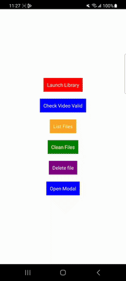

# React Native Video Trim

<div align="center">
  <h3>📱 Native video and audio trimmer for React Native apps</h3>

  <p>
    <strong>✅ iOS & Android</strong> •
    <strong>✅ New & Old Architecture</strong> •
    <strong>✅ Expo development builds</strong>
  </p>

  <p>
    <a href="https://maitrungduc1410.github.io/react-native-video-trim/"><strong>📖 Documentation</strong></a> •
    <a href="https://maitrungduc1410.github.io/react-native-video-trim/guide/quick-start">Quick start</a> •
    <a href="https://maitrungduc1410.github.io/react-native-video-trim/api/">API reference</a> •
    <a href="https://maitrungduc1410.github.io/react-native-video-trim/vi/">Tiếng Việt</a> •
    <a href="https://maitrungduc1410.github.io/react-native-video-trim/zh/">简体中文</a>
  </p>

  
  
</div>

## ✨ Key features

- **📹 Video & audio**: a native trimmer screen with a thumbnail timeline, or a waveform for audio files
- **🔄 Flip, rotate & crop**: built-in edit toolbar with undo and redo
- **🎯 Precise trimming**: optional frame-accurate cuts with hardware re-encoding
- **🔇 Mute & ⏩ speed**: strip the audio or change the speed (0.25x–4x), in the editor or headless
- **⚙️ Headless APIs**: `trim`, `compress`, `getFrameAt`, `extractAudio`, `toGif`, `merge`, `mixAudio`
- **💾 Save & share**: Photos, Documents or the share sheet, plus file management helpers
- **🌐 Local & remote files**: HTTPS sources with the `https` FFmpegKit package
- **🎨 Dark & light theme**: with custom trimmer, handle, header and waveform colors

## Installation

```sh
npm install react-native-video-trim
# or
yarn add react-native-video-trim

# iOS
npx pod-install ios
```

Expo: run `npx expo prebuild` and use a development build (Expo Go is not supported). Permissions, Android build options and the HTTPS setup are covered in the [installation guide](https://maitrungduc1410.github.io/react-native-video-trim/guide/installation).

## Quick start

```tsx
import { useEffect } from 'react';
import VideoTrim, { showEditor, trim } from 'react-native-video-trim';

// Open the editor (all durations are in milliseconds)
showEditor(videoUri, {
  maxDuration: 60_000,
  saveToPhoto: true,
});

// Listen for the result (New Architecture)
useEffect(() => {
  const sub = VideoTrim.onFinishTrimming(({ outputPath }) => {
    console.log('Trimmed file:', outputPath);
  });
  return () => sub.remove();
}, []);

// Or trim without any UI
const { outputPath } = await trim(videoUri, { startTime: 5_000, endTime: 25_000 });
```

> **Old Architecture:** still supported, but support will be removed over time. Events arrive through `NativeEventEmitter` instead of the default export; see the [Old Architecture note](https://maitrungduc1410.github.io/react-native-video-trim/guide/old-architecture).

## Documentation

Everything else lives on the documentation site: **https://maitrungduc1410.github.io/react-native-video-trim/**

- [Opening the editor](https://maitrungduc1410.github.io/react-native-video-trim/guide/editor) and every option
- [Events](https://maitrungduc1410.github.io/react-native-video-trim/guide/events)
- [Headless APIs](https://maitrungduc1410.github.io/react-native-video-trim/guide/headless)
- [Theming](https://maitrungduc1410.github.io/react-native-video-trim/guide/theming), with a live playground
- [Troubleshooting](https://maitrungduc1410.github.io/react-native-video-trim/guide/troubleshooting)
- [API reference](https://maitrungduc1410.github.io/react-native-video-trim/api/)

A complete demo app is in [`example/`](./example/src/).

## Contributing

See [CONTRIBUTING.md](CONTRIBUTING.md). The docs site source is in [`docs/`](./docs/); run `yarn docs:dev` to work on it.

## Credits

- **Android:** based on [Android-Video-Trimmer](https://github.com/iknow4/Android-Video-Trimmer)
- **iOS:** UI from [VideoTrimmerControl](https://github.com/AndreasVerhoeven/VideoTrimmerControl)

## License

MIT