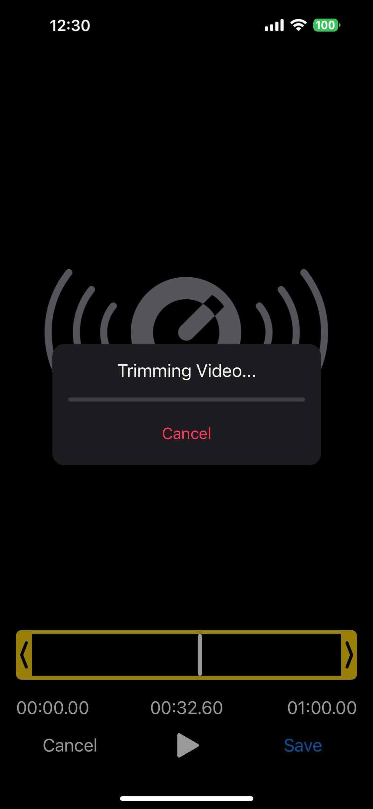
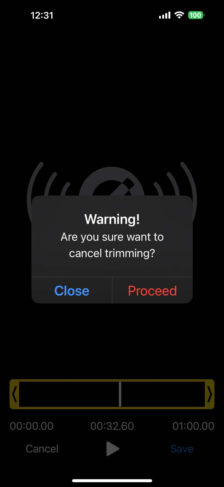

# Opening the editor

```ts
showEditor(filePath: string, config: EditorOptions): void
```

[`showEditor()`](/api/functions/showEditor) presents the native trimmer full screen. `filePath` can be a local path, a `file://` URI, or an HTTPS URL if you installed the [`https` FFmpegKit package](/guide/remote-files). Every option is optional, but always pass an object (`{}` is fine).

```ts
import { showEditor } from 'react-native-video-trim';

showEditor(videoUri, {
  maxDuration: 60_000,
  minDuration: 3_000,
  autoplay: true,
  saveToPhoto: true,
  openShareSheetOnFinish: true,
  headerText: 'Trim your video',
});
```

The function returns immediately. What happens next is reported through [events](/guide/events): `onShow`, `onLoad`, `onStartTrimming`, `onFinishTrimming`, `onCancel`, `onHide` and so on. Call [`closeEditor()`](/api/functions/closeEditor) to dismiss it from code.

The options are typed as [`EditorOptions`](/api/type-aliases/EditorOptions). The tables below group the most useful ones; the API reference for [`EditorConfig`](/api/interfaces/EditorConfig) lists every field.

## Media and output

| Option | Type | Default | Description |
| --- | --- | --- | --- |
| `type` | `'video' \| 'audio'` | `'video'` | Media type. `'audio'` shows a [waveform](/guide/audio). |
| `outputExt` | `string` | `'mp4'` | Output file extension, for example `'mov'`, `'wav'`, `'m4a'`. |
| `maxDuration` | `number` | `-1` (no limit) | Longest allowed selection, in ms. |
| `minDuration` | `number` | `-1` | Shortest allowed selection, in ms. The editor never allows less than 1 s. |
| `enablePreciseTrimming` | `boolean` | `false` | Re-encode for frame-accurate cuts. See [Precise trimming](/guide/precise-trimming). |
| `removeAudio` | `boolean` | `false` | Remove the audio from the output. The editor opens muted, and the output stays silent even if the user unmutes. See [Speed and mute](/guide/speed-and-mute). |
| `speed` | `number` | `1.0` | Initial speed, 0.25 to 4. |

## Playback

| Option | Type | Default | Description |
| --- | --- | --- | --- |
| `autoplay` | `boolean` | `false` | Start playing when the media is loaded. |
| `jumpToPositionOnLoad` | `number` | `-1` | Seek to this position (ms) after loading. |
| `zoomOnWaitingDuration` | `number` | `5000` | When the user holds a handle still, the timeline zooms in to show this many ms around it for finer adjustment. |
| `enableHapticFeedback` | `boolean` | `true` | Haptic feedback while dragging the handles and when they reach either end. |
| `enableEditTools` | `boolean` | `true` | Show the toolbar (flip, rotate, crop, mute, speed, undo, redo). Video only. |

## When the user saves

| Option | Type | Default | Description |
| --- | --- | --- | --- |
| `saveToPhoto` | `boolean` | `false` | Save the output to the photo library. Needs [permission](/guide/installation#ios). |
| `openDocumentsOnFinish` | `boolean` | `false` | Open the system document picker so the user can save the output. |
| `openShareSheetOnFinish` | `boolean` | `false` | Open the share sheet with the output. |
| `closeWhenFinish` | `boolean` | `true` | Dismiss the editor after a successful trim. |
| `removeAfterSavedToPhoto` | `boolean` | `false` | Delete the output after saving it to Photos. |
| `removeAfterFailedToSavePhoto` | `boolean` | `false` | Delete the output if saving to Photos failed. |
| `removeAfterSavedToDocuments` | `boolean` | `false` | Delete the output after saving it through the document picker. |
| `removeAfterFailedToSaveDocuments` | `boolean` | `false` | Delete the output if saving to documents failed. |
| `removeAfterShared` | `boolean` | `false` | Delete the output after sharing (iOS only). |
| `removeAfterFailedToShare` | `boolean` | `false` | Delete the output if sharing failed (iOS only). |

## Text and appearance

| Option | Type | Default | Description |
| --- | --- | --- | --- |
| `theme` | `'dark' \| 'light'` | `'dark'` | Editor theme. See [Theming](/guide/theming). |
| `headerText` | `string` | `''` | Title at the top of the editor. |
| `headerTextSize` | `number` | `16` | Title size in sp/pt. |
| `headerTextColor` | color string | theme based | Title color. |
| `trimmerColor` | color string | `'#f1d247'` | Color of the trimmer frame and handles. |
| `handleIconColor` | color string | theme based | Color of the chevrons on the handles. |
| `cancelButtonText` | `string` | `'Cancel'` | Cancel button label. |
| `saveButtonText` | `string` | `'Save'` | Save button label. |
| `trimmingText` | `string` | `'Trimming video...'` | Text in the progress dialog. |
| `durationFormat` | `string` | `'mm:ss.SSS'` | Format of the time labels, see below. |
| `fullScreenModalIOS` | `boolean` | `false` | iOS: present as a full-screen modal instead of a sheet. |
| `changeStatusBarColorOnOpen` | `boolean` | `false` | Android: make the status bar black while the editor is open. |

### Time label format

`durationFormat` controls the start, current and end labels. It does not change event payloads, which are always raw milliseconds.

| Value | Example |
| --- | --- |
| `'mm:ss'` | `01:23` |
| `'mm:ss.SS'` | `01:23.45` |
| `'mm:ss.SSS'` (default) | `01:23.456` |
| `'hh:mm:ss'` | `00:01:23` |
| `'hh:mm:ss.SSS'` | `00:01:23.456` |

Unknown values fall back to the default.

## Confirmation dialogs

Every dialog can be switched off or reworded, which is also how you localize the editor.

| Dialog | Switch | Text options |
| --- | --- | --- |
| Cancel the editor | `enableCancelDialog` (`true`) | `cancelDialogTitle`, `cancelDialogMessage`, `cancelDialogCancelText`, `cancelDialogConfirmText` |
| Save | `enableSaveDialog` (`true`) | `saveDialogTitle`, `saveDialogMessage`, `saveDialogCancelText`, `saveDialogConfirmText` |
| Cancel a running trim | `enableCancelTrimmingDialog` (`true`) | `cancelTrimmingDialogTitle`, `cancelTrimmingDialogMessage`, `cancelTrimmingDialogCancelText`, `cancelTrimmingDialogConfirmText` |
| Media failed to load | `alertOnFailToLoad` (`true`) | `alertOnFailTitle`, `alertOnFailMessage`, `alertOnFailCloseText` |

```ts
showEditor(videoUri, {
  cancelButtonText: 'Quay lại',
  saveButtonText: 'Xong',
  saveDialogTitle: 'Lưu video?',
  saveDialogMessage: 'Đoạn video đã chọn sẽ được lưu.',
  saveDialogCancelText: 'Không',
  saveDialogConfirmText: 'Lưu',
});
```

## Progress and cancelling

<div class="screenshots">
  
  
</div>

While the file is being processed, the editor shows a progress dialog with `trimmingText`. When `enableCancelTrimming` is `true` (the default), the user can stop the trim; the editor then emits `onCancelTrimming`.

```ts
showEditor(videoUri, {
  trimmingText: 'Processing video...',
  enableCancelTrimming: true,
  cancelTrimmingButtonText: 'Stop',
  enableCancelTrimmingDialog: true,
});
```

To show your own progress UI elsewhere, listen to `onStatistics`, which carries FFmpeg's position (`time`, in ms) and speed. See [Events](/guide/events#progress).

## A complete configuration

```ts
showEditor(videoUri, {
  // range
  maxDuration: 60_000,
  minDuration: 3_000,

  // output
  saveToPhoto: true,
  removeAfterSavedToPhoto: true,
  openShareSheetOnFinish: true,

  // audio and speed
  removeAudio: false,
  speed: 1.0,

  // appearance
  theme: 'light',
  headerText: 'Trim your video',
  cancelButtonText: 'Back',
  saveButtonText: 'Done',
  trimmerColor: '#007AFF',

  // behaviour
  autoplay: true,
  enableCancelTrimming: true,
});
```
