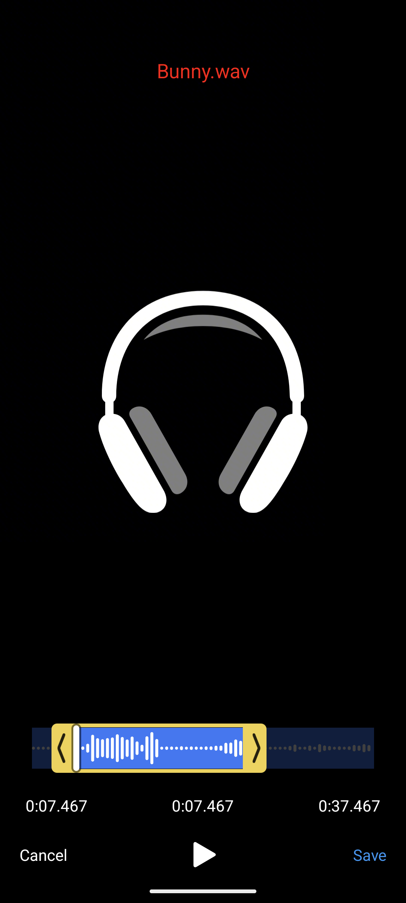
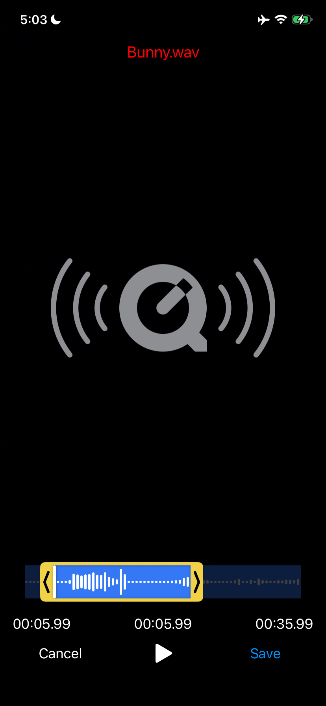

# Cắt âm thanh

<div class="screenshots">
  
  
</div>

Đặt `type: 'audio'` để cắt tệp âm thanh. Trình chỉnh sửa thay dòng thời gian thumbnail bằng dạng sóng và ẩn thanh công cụ chỉnh sửa video.

```ts
showEditor(audioUri, {
  type: 'audio',
  outputExt: 'wav', // hoặc 'm4a', 'mp3', ...
  maxDuration: 30_000,
});
```

Hãy chọn `outputExt` mà bản build FFmpegKit của bạn mã hóa được. `m4a` (AAC) và `wav` dùng được với bản build mặc định; `mp3` cần bản build có `libmp3lame`.

## Dạng sóng {#the-waveform}

Mỗi thanh thể hiện mức RMS của một đoạn âm thanh nhỏ, được chuẩn hóa để thanh lớn nhất cao bằng track. Khi người dùng phóng to, đoạn đang hiển thị được giải mã lại ở độ phân giải cao hơn; khi thu nhỏ, dạng sóng của toàn bộ tệp hiện lại ngay lập tức.

Với tệp âm thanh từ xa, thư viện chỉ tải về một tệp tạm một lần để vẽ dạng sóng, và mọi lần thu phóng đều dùng lại bản sao này. Tệp tạm bị xóa khi trình chỉnh sửa đóng.

## Tùy chỉnh {#customizing-it}

| Tùy chọn | Mặc định | Mô tả |
| --- | --- | --- |
| `waveformColor` | `'white'` | Màu thanh. |
| `waveformBackgroundColor` | `'#3478F6'` | Màu nền track phía sau các thanh. |
| `waveformBarWidth` | `3` | Độ rộng thanh, tính bằng dp/pt. |
| `waveformBarGap` | `2` | Khoảng cách giữa các thanh, tính bằng dp/pt. |
| `waveformBarCornerRadius` | `1.5` | Bán kính bo góc của thanh, tính bằng dp/pt. |

```ts
showEditor(audioUri, {
  type: 'audio',
  outputExt: 'm4a',
  waveformColor: '#1b1b1f',
  waveformBackgroundColor: '#F1D247',
  waveformBarWidth: 2,
  waveformBarGap: 1,
  waveformBarCornerRadius: 1,
});
```

Bạn có thể xem trước màu dạng sóng trong [playground](/vi/guide/theming#try-it) bằng cách chuyển loại media sang âm thanh.

## Cắt âm thanh bằng headless API {#headless-audio-trimming}

[`trim()`](/vi/guide/headless#trim) cũng hoạt động với âm thanh:

```ts
const { outputPath } = await trim(audioUri, {
  type: 'audio',
  outputExt: 'm4a',
  startTime: 10_000,
  endTime: 40_000,
});
```

Nếu muốn tách âm thanh ra khỏi video, hãy dùng [`extractAudio()`](/vi/guide/headless#extractaudio).
