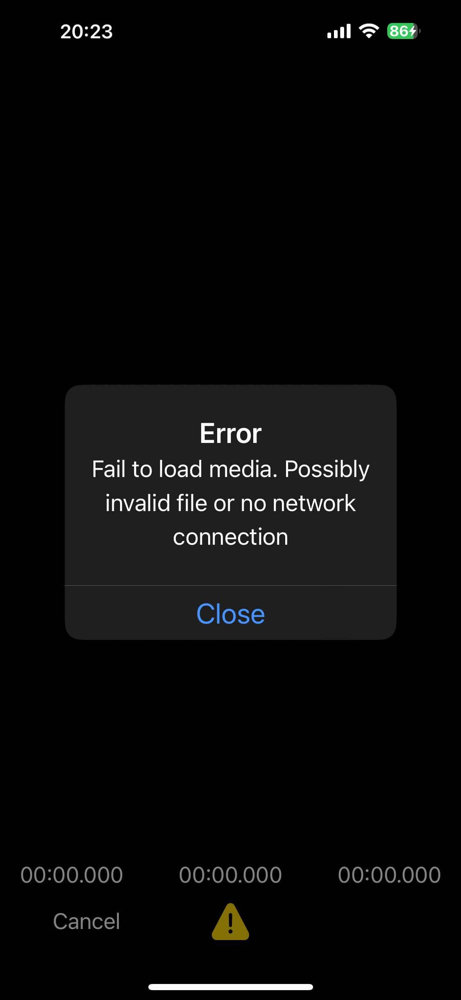

# Xử lý lỗi

Tùy API, lỗi sẽ được báo về theo một trong ba cách.

## Lỗi của trình chỉnh sửa: sự kiện onError {#editor-errors-the-onerror-event}

Trình chỉnh sửa phát `onError` kèm `message` để người đọc và `errorCode` để code xử lý:

```ts
import VideoTrim, { type ErrorCode } from 'react-native-video-trim';

VideoTrim.onError(({ message, errorCode }) => {
  switch (errorCode as ErrorCode) {
    case 'FAIL_TO_LOAD_MEDIA':
      showToast('Không thể mở tệp này.');
      break;
    case 'NO_PHOTO_PERMISSION':
      showToast('Hãy cho phép truy cập ảnh để lưu video.');
      break;
    case 'HARDWARE_ENCODER_FAILED':
      reportToCrashlytics(message);
      break;
    default:
      console.warn(errorCode, message);
  }
});
```

### Mã lỗi {#error-codes}

[`ErrorCode`](/api/type-aliases/ErrorCode) liệt kê các mã lỗi mà phía native có thể gửi về. Không phải mã nào cũng có trên cả hai nền tảng, và sau này có thể có thêm mã mới, nên hãy luôn giữ nhánh `default`.

| Mã lỗi | Nền tảng | Ý nghĩa |
| --- | --- | --- |
| `FAIL_TO_LOAD_MEDIA` | iOS, Android | Không thể mở tệp hoặc URL. |
| `TRIMMING_FAILED` | iOS, Android | FFmpeg gặp lỗi khi tạo tệp đầu ra. |
| `HARDWARE_ENCODER_FAILED` | iOS, Android | Log FFmpeg cho thấy bộ mã hóa video không khởi tạo được. Trên Android, mã này chỉ được báo sau khi đã thử hết các bộ mã hóa dự phòng. Xem [Cơ chế dự phòng bộ mã hóa trên Android](/vi/guide/android-encoder-fallback). |
| `OUTPUT_FORMAT_INCOMPATIBLE` | iOS | Container và codec của tệp đầu ra không kết hợp được với nhau. |
| `FAIL_TO_SAVE_TO_PHOTO` | iOS, Android | Lưu vào thư viện ảnh thất bại. |
| `NO_PHOTO_PERMISSION` | iOS | Quyền truy cập thư viện ảnh bị từ chối. |
| `FAIL_TO_SHARE` | iOS | Bảng chia sẻ gặp lỗi. |
| `INVALID_FILE_PATH` | iOS | Đường dẫn không hợp lệ. Đã khai báo nhưng hiện chưa được phát. |
| `FAIL_TO_SAVE_TO_DOCUMENTS` | Android | Lưu qua trình chọn tài liệu thất bại. |
| `FAIL_TO_GET_VIDEO_INFO` | Android | Không đọc được metadata của media. |
| `FAIL_TO_INITIALIZE_AUDIO_PLAYER` | Android | Không khởi động được trình phát âm thanh. |
| `UNKNOWN` | Android | Các lỗi khác, ví dụ không có activity hiện tại. |

## Lỗi của headless API: Promise bị reject {#headless-errors-rejected-promises}

Các headless API reject với một `Error`. Nếu lỗi đến từ FFmpeg, message chứa toàn bộ log FFmpeg, đúng thứ bạn cần đính kèm khi báo lỗi:

```ts
try {
  await compress(videoUri, { quality: 'low' });
} catch (e) {
  const message = e instanceof Error ? e.message : String(e);
  console.warn(message.split('\n')[0]); // ví dụ: "Compression failed: rc 1"
  logger.debug(message); // toàn bộ output của FFmpeg
}
```

## Tham số không hợp lệ: throw đồng bộ {#invalid-arguments-thrown-synchronously}

`deleteFile()`, `saveToPhoto()`, `saveToDocuments()`, `share()`, `merge()` và `mixAudio()` kiểm tra tham số trước khi gọi xuống native và sẽ **throw** (chứ không reject) khi đường dẫn hoặc danh sách rỗng. Hãy tự kiểm tra trước, hoặc gọi và `await` chúng trong cùng một khối `try`:

```ts
try {
  await share(outputPath); // throw đồng bộ nếu outputPath là ''
} catch (e) {
  // cả lỗi throw lẫn lỗi reject đều rơi vào đây
}
```

## Khi không tải được media {#when-media-cannot-be-loaded}



Theo mặc định, trình chỉnh sửa hiển thị một alert khi không tải được media, và phát `onError` với `FAIL_TO_LOAD_MEDIA`. Bạn có thể đổi nội dung alert, hoặc tắt hẳn bằng `alertOnFailToLoad: false` và hiển thị UI của riêng mình:

```ts
showEditor(videoUri, {
  alertOnFailToLoad: true,
  alertOnFailTitle: 'Rất tiếc!',
  alertOnFailMessage: 'Không thể tải video này.',
  alertOnFailCloseText: 'OK',
});
```

## Tránh lỗi {#avoiding-errors}

- Kiểm tra tệp bằng [`isValidFile()`](/vi/guide/files#managing-outputs) trước khi mở.
- Dùng [package FFmpegKit `https`](/vi/guide/remote-files) cho tệp từ xa.
- Xin quyền truy cập ảnh trước khi dùng `saveToPhoto`.
- Truyền tệp cục bộ cho `merge()` và `mixAudio()`.
