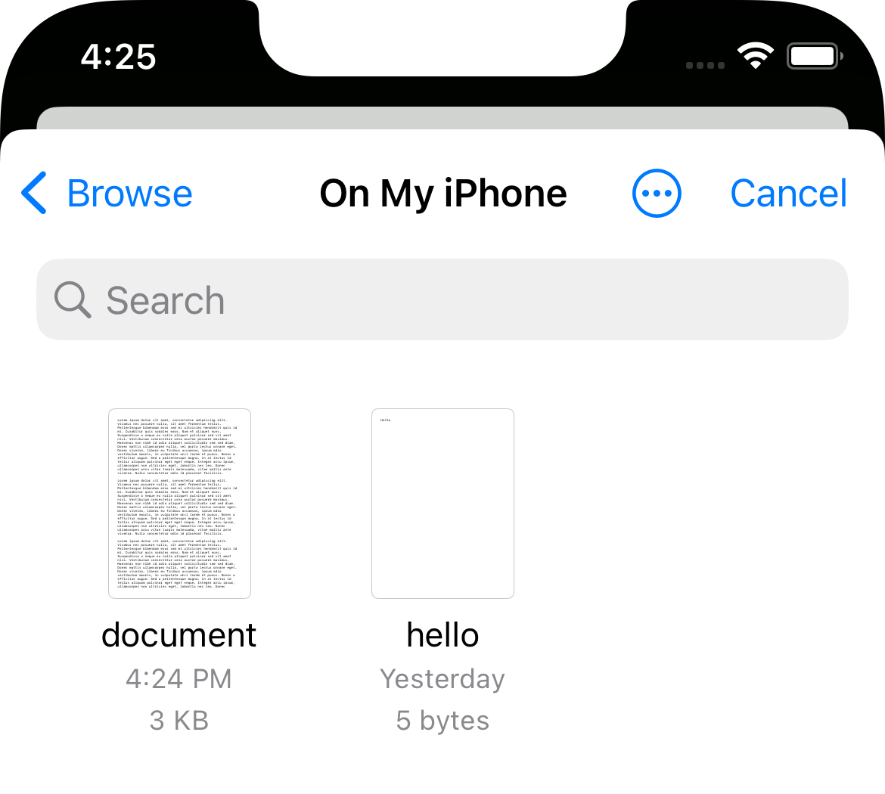
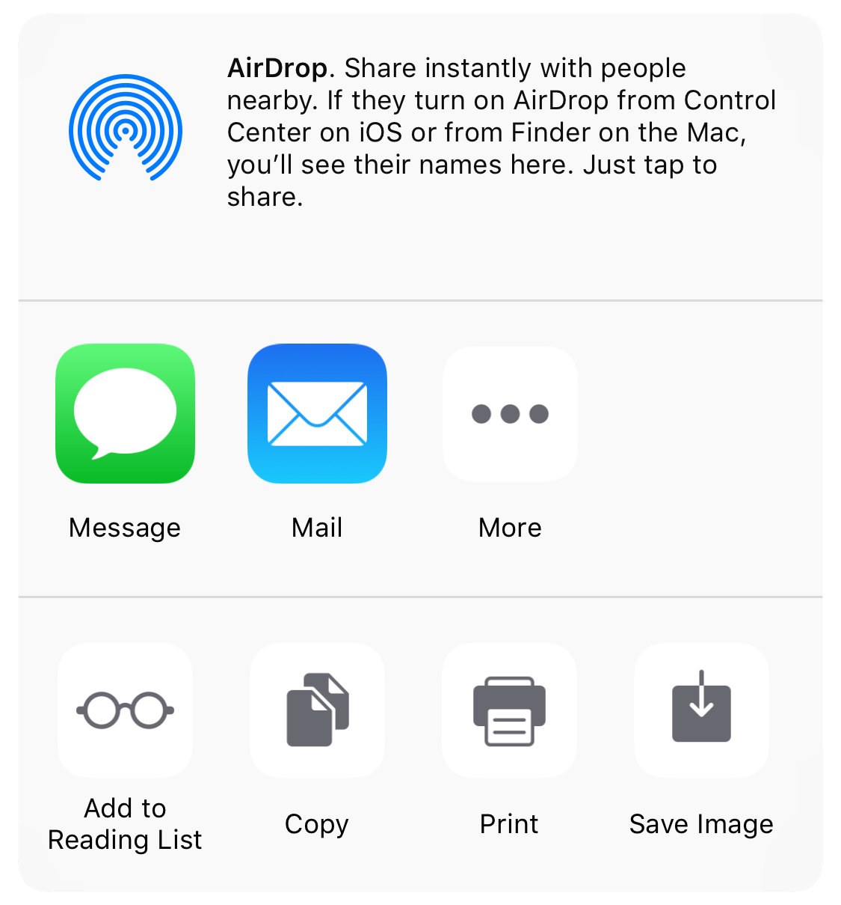

# 文件与保存

<div class="screenshots">
  
  
</div>

## 文件写入位置 {#where-files-are-written}

| 生成方 | 目录 | 保留期限 |
| --- | --- | --- |
| `showEditor()`、`trim()` | 应用 Documents 目录（iOS）/ `filesDir`（Android） | 一直保留，直到你主动删除 |
| `getFrameAt()`、`extractAudio()`、`compress()`、`toGif()`、`merge()`、`mixAudio()` | Caches 目录（iOS）/ `cacheDir`（Android） | 存储空间不足且应用未运行时，系统可能会清除 |

无论文件由哪个 API 生成，用完后都请删除。需要长期保留的文件，请移动到持久存储位置，或用下面的函数保存。

## 保存与分享 {#saving-and-sharing}

这些函数可用于任意 API 的输出。

### 保存到相册 {#save-to-photos}

```ts
saveToPhoto(filePath: string): Promise<SaveToPhotoResult>
```

将图片或视频保存到相册。类型根据文件扩展名判断，因此 `getFrameAt()` 截取的帧会保存为照片。在 iOS 上需要[相册权限](/zh/guide/installation#ios)，在 Android 9 及更早版本上需要存储权限。

```ts
import { compress, saveToPhoto } from 'react-native-video-trim';

const { outputPath } = await compress(videoUri, { quality: 'medium' });
const { success } = await saveToPhoto(outputPath);
```

### 通过文档选择器保存 {#save-to-documents}

```ts
saveToDocuments(filePath: string): Promise<SaveToDocumentsResult>
```

打开系统文档选择器（iOS 上为 `UIDocumentPickerViewController`，Android 上为存储访问框架），由用户选择保存位置。

### 分享 {#share}

```ts
share(filePath: string): Promise<ShareResult>
```

打开分享面板。在 Android 上，文件必须位于本库的输出目录中，而本库的所有输出本来就写在这里。

```ts
const { outputPath } = await merge([clip1, clip2]);
const { success } = await share(outputPath);
```

编辑器也能在用户保存后完成同样的操作：使用 `saveToPhoto`、`openDocumentsOnFinish` 和 `openShareSheetOnFinish`，再通过 `removeAfter*` 选项删除文件。参阅[用户保存时](/zh/guide/editor#when-the-user-saves)。

`filePath` 为空时，这三个函数都会同步抛出错误。

## 管理输出文件 {#managing-outputs}

| 函数 | 返回值 | 说明 |
| --- | --- | --- |
| [`listFiles()`](/api/functions/listFiles) | `Promise<string[]>` | 列出两个输出目录中的所有文件。 |
| [`cleanFiles()`](/api/functions/cleanFiles) | `Promise<number>` | 删除所有输出文件，返回删除的数量。 |
| [`deleteFile(path)`](/api/functions/deleteFile) | `Promise<boolean>` | 删除一个输出文件。在 Android 上，输出目录之外的路径会被拒绝，并 resolve 为 `false`。 |
| [`isValidFile(url)`](/api/functions/isValidFile) | `Promise<FileValidationResult>` | 检查文件是否为可播放的音频或视频。 |

```ts
import { cleanFiles, deleteFile, isValidFile, listFiles } from 'react-native-video-trim';

// 打开编辑器之前先校验
const { isValid, fileType, duration } = await isValidFile(uri);
if (!isValid) {
  console.warn('Not a playable media file');
}

// 删除单个文件
await deleteFile(outputPath);

// 定期清理，例如在应用启动时
const files = await listFiles();
const removed = await cleanFiles();
console.log(`Removed ${removed} of ${files.length} files`);
```

`isValidFile()` resolve 的是对象而不是布尔值，请检查 `isValid`。`fileType` 为 `'video'`、`'audio'` 或 `'unknown'`，`duration` 以毫秒为单位（无效时为 `-1`）。
